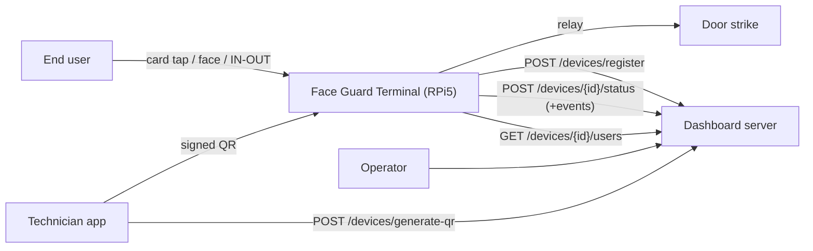
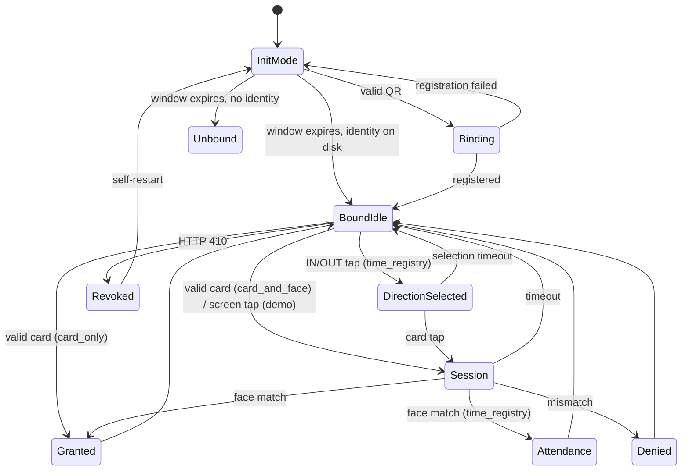
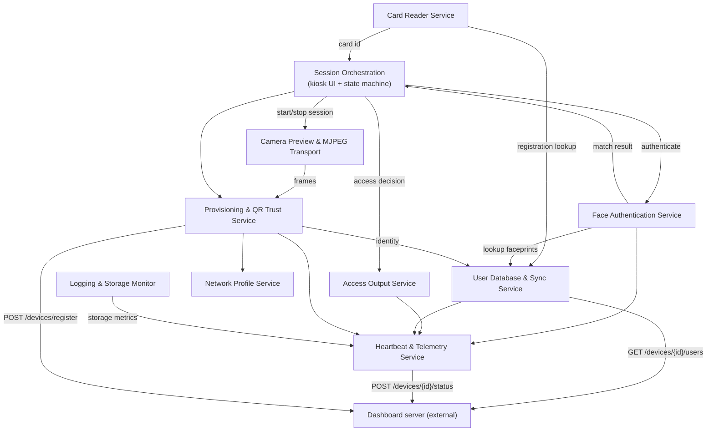

# RSID Face Guard — Software Requirements Specification

**Access Control & Time-Registry Edge Terminal**

| Item | Detail |
|---|---|
| Document ID | SRS-FG-001 |
| Revision | 1.1 |
| Product | RSID Face Guard kiosk application |
| Target platform | Raspberry Pi 5, 720×720 round touch display |
| Biometric device | Intel RealSense ID F45x (`rsid_py` SDK) |
| Front-end in scope | **Web UI** (`main_web.py` → `gui_web` + `demo_ui`) |
| Server | External dashboard server; only the device-facing REST contract is in scope |
| Status | Baselined |

---

## 1. Purpose, Scope and Conventions

### 1.1 Purpose

This document specifies the software requirements for the RSID Face Guard edge
terminal: a Raspberry Pi 5 kiosk that identifies an end user by RFID card and/or
face, opens a door via a relay, registers working-hours (in/out) events, and
reports its state to a central dashboard server.

It is written as a pre-implementation specification: it defines *what* the
device shall do and the contracts it depends on. Section 11 maps every
requirement onto the delivered modules.

### 1.2 Scope

**In scope**

- The kiosk application and all of its device-side services.
- The **web UI** front-end (QtWebEngine kiosk hosting `demo_ui/`).
- Provisioning by signed QR code, and the device↔server REST contract.
- Local user/faceprint storage, offline operation, telemetry and logging.

**Out of scope**

- Server implementation, dashboard pages, database and operator workflows.
  The server is specified here **only** by the endpoints the device calls
  (§8), to be implemented by the server team on request.
- The Qt-widgets front-end (`main_qt.py`, `gui_qt/`). It is a **test and
  development harness only**, not a delivered product configuration. It shares
  the same business layer and validates it without a browser engine.
- Technician mobile application internals.

### 1.3 Conventions

- **Shall** = mandatory. **Should** = recommended. **May** = optional.
- Requirements are numbered `FR-<AREA>-nn` and `NFR-nn`.
- Timestamps exchanged with the server use UTC, `%Y-%m-%dT%H:%M:%SZ`.
- Requirements marked **[NEW]** are not in the current build and are specified
  here as required behaviour (see §12, Known Deviations).

### 1.4 Definitions

| Term | Meaning |
|---|---|
| Terminal / device | The RPi5 kiosk running this software |
| Faceprint | Feature vector produced by the RealSense ID SDK, stored per user |
| Binding / provisioning | Associating a terminal with a server, customer, site and door by scanning a signed QR |
| Init mode | Bounded startup window in which the terminal scans for a provisioning QR |
| Session | A bounded authentication attempt window with the camera active |
| Revocation | Server-initiated removal of a terminal (HTTP 410) |
| Door DB | The per-device user set the server sends to this terminal |

---

## 2. System Context

### 2.1 Actors

| Actor | Interaction |
|---|---|
| End user | Taps a card, presents their face, selects IN/OUT |
| Technician | Provisions the terminal by showing a signed QR from the technician app |
| Dashboard operator | Creates doors, assigns users, removes (revokes) devices |
| Dashboard server | Issues QRs, registers devices, serves the door DB, receives status and events |

### 2.2 Hardware

| Component | Purpose |
|---|---|
| Raspberry Pi 5 | Application host |
| 720×720 round touch display | Kiosk UI, tap input |
| Intel RealSense ID F45x | Face capture and matching, and QR image source |
| Card reader | GWIOT USB-HID (production), Wiegand GPIO (legacy), simulated (dev) |
| Relay (GPIO 18) | Door strike |
| Network | Ethernet or Wi-Fi (Wi-Fi may be joined from the provisioning QR) |

### 2.3 Context diagram



---

## 3. Operating States



**Connectivity is orthogonal to the operating state.** Server reachability is
an *attribute* of a bound terminal, not a state of its own: a terminal with a
valid local database performs the full access flow — card read, face
verification, authorisation, relay, attendance capture — identically whether
or not the server is reachable. Losing the network changes only what the
terminal can *report* and how fresh its data is, never what it can *decide*.


| State | Behaviour |
|---|---|
| `init_mode` | **The entry state.** Hardware discovery and initialisation, then a live preview scanning for a provisioning QR for a bounded window. Entered on every start, whether or not the terminal is already bound, so a technician can re-provision (FR-PROV-10). Only the *duration* is configurable: `INIT_MODE_ENABLED = false` is equivalent to a zero-length window that falls straight through to the resting state |
| `binding` | QR accepted; network profile applied and registration in flight |
| `unbound` | No identity; no server sync; QR instruction shown. **Does not scan**; re-provisioning requires a restart into `init_mode` |
| `bound_idle` | Screensaver; card monitor armed; heartbeat running |
| `direction_selected` | `time_registry` only: IN or OUT latched, awaiting a card tap or selection timeout |
| `session` | Camera on, face match retried |
| `granted` / `denied` | Result screen for a fixed hold |
| `attendance` | `time_registry` only: direction registered, result screen for a fixed hold, **no relay** |
| `revoked` | Transient. Identity dropped, **local user DB purged, all access denied**, then orderly self-restart (FR-HB-10) |

| Connectivity attribute | Effect |
|---|---|
| `server_online` | Heartbeats acknowledged, events drained, DB refreshed on schedule |
| `server_offline` | **Access flow unchanged**; events accumulate; DB stays at its last good version; retries back off |


**FR-STATE-01** The terminal shall persist its binding across restarts and
resume `bound_idle` without operator action.

**FR-STATE-02** In `remote` database mode the terminal shall never grant access
in `unbound` or `revoked` state. In `local` database mode the terminal
authorises from its local file and the binding states do not apply: an
unprovisioned `local` terminal is a valid, fully functional configuration.

**FR-STATE-03** A state transition shall never interrupt an in-flight
authentication; background work shall not pre-empt a session.

### 3.1 Offline operation

**FR-STATE-04** A bound terminal holding a valid local database shall perform
the **complete** access flow while the server is unreachable, in every
operating mode: card lookup, 1:1 face verification, the authorisation
decision, relay actuation and IN/OUT attendance capture. Offline operation is
normal operation, not a reduced mode.

**FR-STATE-05** No door decision shall ever depend on a live server call. All
lookups read the local cache (FR-DB-04), so server latency or absence cannot
delay or block an access attempt.

**FR-STATE-06** While offline the terminal shall retain its last successfully
synchronised database and continue to authorise from it. A failed sync shall
never clear, expire or invalidate the cached user set.

**FR-STATE-07** Events generated offline — including `access_granted`,
`access_denied` and `attendance_event` — shall be retained locally and
delivered once connectivity returns, subject to the buffering limits of §9
(FR-HB-05, FR-HB-07) and the durability requirement for attendance
(FR-MODE-10).

**FR-STATE-08** Reconnection shall be automatic and require no operator
action: heartbeat retries back off while offline and reset on the first
success (FR-HB-08), buffered events drain on the next acknowledged heartbeat,
and the database resumes refreshing on its normal `DB_SYNC_INTERVAL_SEC`
cadence.

**FR-STATE-09** Database synchronisation is **periodic and asynchronous**, not
transactional with access attempts: the local cache may lag the server by up
to one sync interval. A user added or removed on the server takes effect at
the next successful sync.

**FR-STATE-10** A sync failure shall be logged and reported as an event, and
shall not surface as a user-visible error on the idle screen; the terminal
shall keep serving users normally.

**FR-STATE-11** Loss of connectivity shall **not** be treated as revocation.
Only an explicit HTTP 410 triggers the fail-secure purge of FR-HB-10; an
unreachable server shall never deny access to an otherwise valid user.

**FR-STATE-12** The UI **may** indicate the offline condition, provided the
indication does not obstruct or delay normal user interaction.


---

## 4. Device Operating Modes

The terminal supports three mutually exclusive modes.

| Mode | Trigger | Face step | Relay | Event |
|---|---|---|---|---|
| `card_only` | Valid card tap | **skipped** | opens | `access_granted` |
| `card_and_face` | Valid card tap | 1:1 verify against cardholder | opens on match | `access_granted` / `access_denied` |
| `time_registry` | End user selects IN or OUT, then taps card | per §4.3 face policy | **no door output** | `attendance_event` |

**FR-MODE-01** The mode shall be provisioned **per door by the server**,
returned in the registration response and refreshable through the heartbeat
response. `config.py` shall hold only an install-time fallback default.
*(Assumption A1.)*

**FR-MODE-02** In every mode, a card that is not present in the local door DB
shall be rejected **before the camera is started** (§6.3).

**FR-MODE-03 `card_only`** — on a valid card the terminal shall open the relay
immediately, with no face step. The decision path is
`Card Reader → Session Orchestration → Access Output`; the Face Authentication
Service is not involved and no session or camera preview is started. **[NEW]**

**FR-MODE-04 `card_and_face`** — on a valid card the terminal shall start a
session and verify the live face 1:1 against that cardholder's stored
faceprints only. This is the default production mode.

**FR-MODE-05** A face-only (1:N) trigger by screen tap shall exist as a
non-production/demo configuration only, and shall not be enabled at a door
that has a card reader.

### 4.3 Time-registry mode **[NEW]**

Working-hours journalling: the end user declares direction, then identifies.

The **face policy** referenced below is an explicit per-door setting with
exactly two values, provisioned alongside `device_mode` (FR-MODE-01):

| Face policy | Behaviour on card tap |
|---|---|
| `none` | The card alone registers the direction; no session, no camera |
| `verify` | A session is started and the live face is verified 1:1 against the cardholder, exactly as in `card_and_face`; a mismatch registers nothing |

**FR-MODE-06** The terminal shall present an IN/OUT selection screen in place
of the screensaver. The selection shall be latched until the following card
tap completes, or until a selection timeout returns the UI to its resting
state.

**FR-MODE-07** After a direction is selected and a registered card is tapped,
the terminal shall perform the identification defined by the configured face
policy (`none` or `verify`, above) and, on success, emit an
`attendance_event` carrying `user_id` (FR-DATA-06), `direction` (`in`/`out`)
and the UTC timestamp.

**FR-MODE-08** In `time_registry` the terminal shall **not** actuate the
relay. *(Assumption A2; combined access+attendance is a future extension.)*

**FR-MODE-09** Attendance events shall be delivered over the same
buffered-event channel as all other events (§9), with `event_id` idempotency.

**FR-MODE-10** Attendance events **should** be queued **durably on disk**
rather than in the volatile buffer of §9: losing a check-in is a payroll
error, not a lost telemetry line.

**FR-MODE-11** The server shall persist attendance events and expose a
per-end-user working-hours journal (server-side requirement, §8.6).


---

## 5. Service Architecture

The application is decomposed into the following cooperating services. Each
runs in the single kiosk process; long-running work is on background threads
so the UI thread is never blocked.



The access decision is owned by Session Orchestration, never by the Face
Authentication Service (FR-FACE-04). In `card_only` the path is
`CR → UI → AO` with no biometric stage at all. Logging is cross-cutting: every
service writes through the shared logger tree (FR-LOG-01); the only graph edge
shown is the storage metric the monitor contributes to each heartbeat
(FR-LOG-05). Database synchronisation and heartbeating are **independent**
HTTP paths on separate schedules — events piggyback on the heartbeat (FR-HB-04),
but the door DB does not.

### 5.1 Session Orchestration Service

Owns the kiosk window, the UI state machine and the lifecycle of every
authentication session.

**FR-SESS-01** The service shall host the web UI full-screen in kiosk mode and
serve its assets and the camera stream over a loopback HTTP origin so the page
and the stream are same-origin.

**FR-SESS-02** The camera preview shall be **off while idle** and shall be
started only for the duration of a session, to avoid a permanently streaming
camera and its associated restart stutter.

**FR-SESS-03** A session shall be started by a valid card tap (card modes) or
a screen tap (demo face-only mode), and never while a session or init mode is
already active. A **different** valid card presented during a result-screen
hold shall pre-empt the result and start a new session (BR-04).

**FR-SESS-04** During a **face-only (demo) session** the service shall retry
face matching every `AUTH_RETRY_INTERVAL_SEC` until a match succeeds or
`AUTH_SESSION_TIMEOUT_SEC` elapses. In card-triggered modes the session ends
on the **first** conclusive mismatch, per BR-05; retrying is not performed
because the identity to verify against is already known from the card.

**FR-SESS-05** Only one authentication attempt shall be in flight at a time;
a retry tick arriving while an attempt runs shall be skipped.

**FR-SESS-06** On success the service shall stop all session timers
immediately, before showing the result, so no further attempt can fire during
the result hold.

**FR-SESS-07** Authentication shall run on a worker thread and its result
shall be marshalled back onto the UI thread for rendering.

**FR-SESS-08** On session end the service shall pause the preview, clear any
card-session flag and return to the resting screensaver.

### 5.2 Face Authentication Service

Encapsulates all biometric business logic; contains no UI or transport code.

**FR-FACE-01** The service shall connect to the RealSense ID device over its
serial port at startup and expose 1:1 (card-bound) and 1:N (face-only)
authentication operations.

**FR-FACE-02** For 1:1, the live faceprint shall be matched **only** against
the faceprints stored for the cardholder.

**FR-FACE-03** A match shall be accepted when the SDK reports success **or**
when the returned score is greater than or equal to `CUSTOM_THRESHOLD`. This
score fallback shall be configurable and its value recorded in the decision
log.

**FR-FACE-04** Identification and the access decision shall be distinct
stages: a biometric match alone shall not actuate the door.

**FR-FACE-05** Failure to extract a faceprint, absence of stored faceprints
for the user, and a score below threshold shall each produce a distinct,
logged denial reason.

**FR-FACE-06** On an SDK/hardware exception the service shall block further
authentication for a backoff period (20 s), start a background reconnect, and
report a `hardware_error` event. The internal cause shall not be shown to the
user, but the condition shall be surfaced to the UI as a distinct
"temporarily unavailable" outcome (FR-UI-12) — a user standing at the door
after a card tap shall never be left without feedback.

**FR-FACE-07** The service shall never grant access as a result of an internal
error; all error paths shall be fail-secure.


### 5.3 Card Reader Service

**FR-CARD-01** The service shall abstract the reader behind a single interface
and select one backend by configuration: GWIOT USB-HID (production), Wiegand
GPIO (legacy), or a simulator for development off the Pi.

**FR-CARD-02** A background monitor thread shall poll for card reads and
notify the session service; polling shall never block the UI thread.

**FR-CARD-03** The monitor shall suppress a repeated read of the **same** card
within a cooldown window (2 s) to prevent duplicate sessions from one physical
tap.

**FR-CARD-04** The monitor shall skip reads entirely while a card-triggered
session is already in progress, and resume when that session ends.

**FR-CARD-05** The monitor shall check card registration against the local DB
(a fast, camera-free lookup) and shall report registered and unregistered
cards through separate callbacks.

**FR-CARD-06** A reader exception shall be logged, reported as a hardware
error event, and followed by a retry delay; it shall not terminate the monitor
thread or the application.

### 5.4 Access Output Service

**FR-OUT-01** The relay shall be the sole access output. It shall be driven on
a configurable GPIO pin with configurable active-low polarity and a defined
default-off state at startup.

**FR-OUT-02** On an approved decision the relay shall be pulsed for the
configured activation duration, asynchronously, so the UI result is not
delayed by the pulse.

**FR-OUT-03** Relay actuation shall emit a `relay_opened` event.

**FR-OUT-04** A Wiegand transmitter shall be initialised and reserved for a
future external-controller mode; it is **not** used as an access output in
this release. Its initialisation failure shall be non-fatal.

**FR-OUT-05** If the relay is disabled or fails to initialise, the terminal
shall continue to operate and log the condition, degrading gracefully rather
than exiting.

**FR-OUT-06** An approved decision followed by an output failure shall be
recorded distinctly from a denial.

### 5.5 User Database & Sync Service

**FR-DB-01** The local database shall hold, per user: badge/card id, stable
`user_id`, display name, `active` flag, permission level and a list of zero or
more faceprints, persisted as a local JSON store and written atomically (temp
file + rename) so a power cut cannot leave a truncated file.

**FR-DB-02** The database shall be the **single authority for authorisation**:
the server sends only the users relevant to this device's door, therefore
**presence of a valid, active record in the local DB constitutes
authorisation**. The `permission_level` field is informational only.

**FR-DB-03** In `remote` mode the service shall periodically refresh the local
cache from the server every `DB_SYNC_INTERVAL_SEC`, on a background thread.

**FR-DB-04** All authentication lookups shall read the **local cache**, never
the network, so a slow or absent server can never delay a door decision.

**FR-DB-05** A sync shall replace the cache only when a well-formed payload
was received; malformed records shall be skipped and counted, and a wholly
invalid response shall leave the previous cache intact.

**FR-DB-06** Sync outcomes shall emit `db_sync_ok`, `db_sync_failed`,
`db_sync_invalid_record` or `db_sync_skipped_entries` events as appropriate.

**FR-DB-07** If the device is not bound, remote sync shall be skipped until
binding completes.

**FR-DB-08** The `GET /devices/{id}/users` payload is a **full replacement
set**, not a delta: the server does not send a removal list. Users present in
the local cache but **absent from a well-formed payload** shall therefore be
dropped locally and `db_users_revoked` emitted. This inference is only valid
for a payload that passed the FR-DB-05 well-formedness check; a malformed or
failed response shall never be interpreted as "all users removed".


### 5.6 Provisioning & QR Trust Service

**FR-PROV-01** Init mode is the terminal's entry state: on every start it
shall show a live preview and scan for a provisioning QR for
`INIT_MODE_DURATION_SEC`, whether or not it is already bound. If nothing is
found within the window the terminal shall fall through to its resting state
with no additional delay. Configuration controls only the duration of this
window, not whether it is entered.

**FR-PROV-02** The QR payload shall be a JSON envelope containing at minimum:
`schema`, `command`, `server_url`, `customer_id`, `site_id`, `door_id`,
`provisioning_token`, `issued_at`, `expires_at`, `nonce`, `network_profile`
and a `signature` block (`algorithm`, `key_id`, `value`).

**FR-PROV-03** The terminal shall accept the envelope only if **all** of the
following pass, entirely offline, with no network call required:
schema matches the expected version; the `key_id` resolves to a locally
trusted public key; the Ed25519 signature verifies over the canonical payload;
`expires_at` is in the future; and the `nonce` has not been seen before.

**FR-PROV-04** The terminal shall hold **only public keys**, one PEM per
trusted `key_id`, in a configured trust-store directory. A missing or empty
trust store shall cause all QRs to be rejected.

**FR-PROV-05** Rejections shall be logged with an outcome line and classified:
benign rejections (wrong schema, expired) at warning level; potential forgery
or replay (bad signature, unknown key, reused nonce) at error level with a
`SECURITY:` marker. A rejected QR shall emit `qr_rejected`; an accepted one
`qr_accepted`.

**FR-PROV-06** Only the `provision_device` command shall be accepted in this
release. The envelope shall remain extensible for future commands, but no
factory-reset or maintenance command shall be honoured. *(Per decision: bind
and revoke only.)*

**FR-PROV-07** On a valid QR the terminal shall apply any network profile
(§5.7), then register with the server, on a background thread, never blocking
the UI.

**FR-PROV-08** The registration result shall be displayed to the technician;
a failure shall remain visible longer than a success so the reason can be
read, and shall surface the server's reason rather than a bare status code.

**FR-PROV-09** The identity returned by the server (device id, bearer token,
server URL, customer/site/door, heartbeat interval) shall be persisted
atomically and treated as a credential: owner-readable only and excluded from
version control.

**FR-PROV-10** Re-scanning a QR on an already-bound terminal shall **replace**
the existing binding, so a technician can move a terminal to another door
without a separate reset step.

**FR-PROV-11** The provisioning token shall be one-time; it shall not be
retained after a successful registration.

### 5.7 Network Profile Service

**FR-NET-01** A QR may carry a network profile of mode `local` (already
cabled) or `wifi` (with SSID and password).

**FR-NET-02** When enabled by configuration, a `wifi` profile shall cause the
terminal to join that network via NetworkManager **before** registering, so a
terminal with no cable can come online from the QR alone.

**FR-NET-03** A `local` profile, or the feature being disabled, shall be a
no-op. The feature shall default to disabled so a developer machine is never
reconfigured.

**FR-NET-04** Joining shall be bounded by a timeout; failure shall be reported
as a registration failure with a clear message.

**FR-NET-05** The Wi-Fi password is signed but **not encrypted** inside the
QR. This shall be documented as an accepted risk: anyone photographing the QR
can read it, so QR validity windows shall be kept short.


### 5.8 Heartbeat & Telemetry Service

**FR-HB-01** A bound terminal shall POST its status to the server every
`heartbeat_interval_sec` (server-supplied at registration, default 30 s) on a
background thread.

**FR-HB-02** Each heartbeat shall carry a status string and a metadata object
including application version, session activity, storage metrics and any
buffered events.

**FR-HB-03** Notable occurrences shall be recorded as **events** in a
thread-safe, bounded, in-memory ring buffer. `emit()` shall be callable from
any thread and shall never block or raise — telemetry must never be able to
break the door.

**FR-HB-04** Events shall not use their own connection: they shall piggyback
on the heartbeat.

**FR-HB-05** Events shall be removed from the buffer **only after** a
successful (2xx) heartbeat, and shall be removed **by `event_id`**, never by
count. Because the buffer is a bounded drop-oldest ring (FR-HB-07), events may
be evicted while a heartbeat is in flight; acknowledging by position would
therefore discard entries the server never received. A failed beat shall leave
the listed events buffered for the next one.

**FR-HB-06** Each event shall carry a UUID `event_id` so the server can
deduplicate idempotently if a beat is delivered but its response is lost.

**FR-HB-07** The buffer shall be capped (200 events, drop-oldest) so a long
outage cannot grow memory without bound on an SD-card-backed kiosk. Loss of
the oldest events under sustained outage is an accepted limitation.

**FR-HB-08** On a transient failure the interval shall back off
exponentially up to a maximum, and reset to the normal interval on the first
success.

**FR-HB-09** On shutdown the terminal shall emit `device_shutdown` and make a
single best-effort synchronous flush of buffered events. Shutdown shall never
be blocked by the network.

**FR-HB-10 (Revocation — fail-secure)** On HTTP **410** the terminal shall
treat the device as removed and shall, in this order:
1. emit `device_revoked` and make one best-effort synchronous flush of the
   buffered events (FR-HB-09), **before** the credential is destroyed, so the
   transition is auditable server-side;
2. stop heartbeating;
3. delete the stored identity, so a restart cannot silently rebind;
4. **purge the local user database**, including all faceprints (FR-DATA-02).
   This is safe because the server is the master copy of every faceprint
   (§8.6) and the set is restored by the first sync after re-provisioning;
5. **deny all access** from that point on;
6. perform an orderly self-restart under the supervising systemd service
   (NFR-21), so the terminal re-enters `init_mode` and a technician can
   re-provision it by presenting a new QR without a power cycle.

Revocation is equivalent to a reset. **[NEW]** — see §12.

### 5.9 Logging & Storage Monitor

**FR-LOG-01** All modules shall log through one shared logger tree writing to
console and a size-limited rotating file, with a global level and per-module
overrides configurable without code changes.

**FR-LOG-02** Native SDK log output shall be bridged into the same logger so
device-level diagnostics land in one place.

**FR-LOG-03** Security-relevant outcomes (QR accept/reject, access decisions,
binding, revocation) shall always be logged regardless of module verbosity.

**FR-LOG-04** Secrets shall never be written to logs: bearer tokens, Wi-Fi
passwords, private keys and raw faceprint vectors.

**FR-LOG-05** Free disk space shall be checked periodically; crossing below a
configured minimum shall log a warning and emit a storage event once per
crossing, and the latest reading shall be attached to every heartbeat.

### 5.10 Camera Preview & MJPEG Transport

**FR-CAM-01** Camera streaming shall run on a background thread that can be
paused and resumed, exposing frames to both the UI and the QR scanner.

**FR-CAM-02** For the web UI, frames shall be re-served as an MJPEG stream
over the loopback HTTP origin and displayed by an image element, since the
browser engine cannot access the RealSense camera directly.

**FR-CAM-03** The page shall detect a stalled stream and reconnect
automatically, because a stalled MJPEG image element does not raise an error
on its own.

**FR-CAM-04** The preview shall be paused during faceprint extraction and
resumed afterwards if the session is still active, so the SDK and the preview
do not contend for the camera.


---

## 6. Business Rules and Timing

### 6.1 Decision rules

**BR-01 Authorisation = local membership.** The server sends only the users
relevant to this device's door. A valid, active record in the local DB
therefore *is* the authorisation. No per-door permission or schedule check is
performed on the device.

**BR-02 Card must be known before the camera runs.** An unregistered card is
rejected on a DB-only lookup; the preview is never started for a card that
could not succeed.

**BR-03 Face acceptance.** A match is accepted when the SDK reports success
**or** the score ≥ `CUSTOM_THRESHOLD`.

**BR-04 One tap, one session.** Repeats of the **same** card inside the
cooldown, and any read during an active card session, are ignored. A
**different** card presented while a result screen is still held shall
immediately pre-empt that screen and start a new session, rather than being
swallowed: the cooldown is a per-card debounce, not a global input lock, and
`FAIL_DURATION_MS` (3 s) is longer than the cooldown (2 s), so a global lock
would silently drop a legitimate second user.

**BR-05 A card is either yours or it isn't.** On a card session whose face
does not match, the terminal shows the denial **once** and returns to rest —
it does not keep retrying for the remainder of the session timeout.

**BR-06 Fail-secure.** Any error in a security-relevant component results in
denial, never in an open door.

**BR-07 Revocation is a reset.** A revoked terminal purges its user data and
denies everyone until it is re-provisioned.

### 6.2 Timing parameters

| Parameter | Value | Meaning |
|---|---|---|
| `INIT_MODE_DURATION_SEC` | 8 s | Provisioning QR scan window at startup |
| `AUTH_RETRY_INTERVAL_SEC` | 3 s | Face match retry cadence in a session |
| `AUTH_SESSION_TIMEOUT_SEC` | 30 s | Maximum session duration |
| Card cooldown | 2 s | Same-card duplicate suppression |
| `WELCOME_DURATION_MS` | 3000 ms | "Welcome" hold |
| `FAIL_DURATION_MS` | 3000 ms | Denial hold |
| `HEARTBEAT_INTERVAL_SEC` | 30 s | Status POST cadence (server may override) |
| `DB_SYNC_INTERVAL_SEC` | 600 s | Door DB refresh cadence |
| `CUSTOM_THRESHOLD` | 400 | Score fallback acceptance threshold |
| Auth error backoff | 20 s | Auth blocked while reconnect runs |
| Registration display | 3 s ok / 6 s fail | Technician feedback hold |

---

## 7. User Interface Requirements

### 7.1 Screen states

**FR-UI-01** The web UI shall implement at least: screensaver (resting),
live-camera/session, success ("Welcome" with the user's name when available),
failure ("not authorized"), status overlay (provisioning/maintenance
messages), and — in time-registry mode — the IN/OUT selection screen.

**FR-UI-02** The status overlay shall be independent of the demo UI's own
state machine, so provisioning progress can be shown over any state.

**FR-UI-03** After a success or attendance hold, the UI shall return explicitly
to its **resting screen** — the screensaver in card modes, or the IN/OUT
selection screen in `time_registry` — never to the live-camera state.

### 7.2 Denial behaviour (four distinct paths)

**FR-UI-04 Unregistered card** — show the failure screen for
`FAIL_DURATION_MS` **without starting the camera**, then return to the
screensaver.

**FR-UI-05 Registered card, face mismatch** — show the failure screen once for
`FAIL_DURATION_MS`, cancel session timers, then return to the screensaver.

**FR-UI-06 Face-only (demo) timeout** — return silently to the screensaver
with no failure screen.

**FR-UI-07** Internal denial reasons (score, SDK status, extraction failure)
shall **not** be shown to the user; they shall appear only in logs and
telemetry.

**FR-UI-12 Biometric device unavailable** — while the authentication backoff
of FR-FACE-06 is active, a valid card tap shall show a distinct
"temporarily unavailable, try again shortly" screen for `FAIL_DURATION_MS` and
return to the screensaver. This is a fail-secure outcome: the door does not
open. It shall be visually distinguishable from a face mismatch, so a user is
not led to believe their credential was rejected.

### 7.3 Input and presentation

**FR-UI-08** A tap on the resting screen shall wake the terminal only in the
demo face-only configuration; in card modes the card tap is the sole trigger.

**FR-UI-09** The PIN/keypad code-entry path present in the UI assets is a
demonstration feature. It shall have **no authorisation effect** and shall be
disabled in production builds.

**FR-UI-10** Branding, copy and localisation are designer-provided assets in
the web UI directory and shall be replaceable without code changes.

**FR-UI-11** The UI shall be sized for the 720×720 round display and shall run
borderless/full-screen in kiosk mode, with a windowed mode available for
development.


---

## 8. External Interfaces

### 8.1 Interface summary

| Interface | Direction | Transport |
|---|---|---|
| RealSense ID SDK | Device ↔ camera | USB serial (`/dev/ttyACM0`), `rsid_py` |
| Card reader | Reader → device | USB-HID (evdev) or Wiegand GPIO |
| Relay | Device → door | GPIO (lgpio) |
| Kiosk UI | Process-internal | Loopback HTTP + MJPEG + JS/Python bridge |
| Dashboard server | Device ↔ server | HTTPS/JSON REST |

### 8.2 Server API — general rules

**FR-API-01** Endpoints consumed by the terminal are: `POST /devices/register`,
`POST /devices/{device_id}/status`, `GET /devices/{device_id}/users`. The
technician-side `POST /devices/generate-qr` is invoked by the technician
application, not by the terminal.

**FR-API-02** The server base URL shall come **from the signed QR**, never
from local configuration — this is how a fresh terminal learns which
deployment it belongs to.

**FR-API-03** After registration, every request shall authenticate with the
issued bearer device token.

**FR-API-04** All requests shall use a bounded timeout and shall distinguish
connection failure, timeout, permanent 4xx and transient 5xx.

**FR-API-05** Production deployments shall use HTTPS with certificate
validation enabled.

### 8.3 `POST /devices/generate-qr` — technician → server

Mints a one-time provisioning token and returns the signed QR.

```jsonc
// request
{ "customer_id": "acme", "site_id": "hq", "door_id": "main-entrance",
  "validity_minutes": 10,
  "network_profile": { "mode": "wifi",
                       "wifi": { "ssid": "acme-guest", "password": "s3cr3t" } },
  "device_mode": "card_and_face" }        // NEW: provisions the door's mode

// response
{ "token": "...", "nonce": "...", "issued_at": "...", "expires_at": "...",
  "payload": { /* full signed envelope, incl. network_profile + device_mode */ },
  "qr_png": "data:image/png;base64,..." }
```

**FR-API-06** The envelope shall be Ed25519-signed by the server and shall
carry a short validity window and a one-time nonce.

### 8.4 `POST /devices/register` — terminal → server

No auth: the provisioning token *is* the credential.

```jsonc
// request
{ "token": "<provisioning_token from the QR>",
  "nonce": "<nonce from the QR>",
  "mac": "aa:bb:cc:dd:ee:ff",
  "device_type": "F455", "fw_version": "6.1.0", "app_version": "face-guard-0.1.0" }

// response
{ "device_id": "uuid", "device_token": "...", "heartbeat_interval_sec": 30,
  "customer_id": "acme", "site_id": "hq", "door_id": "main-entrance",
  "device_mode": "card_and_face",          // NEW (FR-MODE-01)
  "registered_at": "2026-07-27T15:02:00Z" }
```

**FR-API-07** The token shall be single-use; redeeming an expired, unknown or
already-used token shall fail with a reason the technician can act on
("generate a new QR" vs. "already bound").

**FR-API-08** Re-registration of an existing terminal shall replace its prior
binding (FR-PROV-10).

### 8.5 `POST /devices/{device_id}/status` — terminal → server

Heartbeat plus piggybacked events. Bearer authenticated.

```jsonc
// request
{ "status": "online",
  "metadata": {
    "app_version": "face-guard-0.1.0",
    "session_active": false,
    "storage": { "free_mb": 12280, "low": false },
    "events": [
      { "event_id": "uuid", "type": "access_granted",
        "ts": "2026-07-27T15:04:11Z",
        "user_id": "u-8f2c1a", "method": "card" }
    ] } }
```

**FR-API-09** A 2xx response acknowledges the listed events; the terminal then
drops them. Any other outcome shall leave them buffered.

**FR-API-10** The server shall deduplicate by `event_id` (insert-or-ignore).

**FR-API-11** **HTTP 410** shall mean "this device was removed" and shall
trigger the fail-secure revocation of FR-HB-10.

**FR-API-12** The response **should** be able to carry an updated
`device_mode` and `heartbeat_interval_sec`, letting the operator retune a door
without re-provisioning. **[NEW]**

### 8.6 `GET /devices/{device_id}/users` — terminal → server

Returns **only** the users authorised for this terminal's door — the data
minimisation that makes BR-01 sound.

```jsonc
{ "users": {
    "12345": { "user_id": "u-8f2c1a",
               "name": "Emma Stone",
               "active": true,
               "permission_level": "employee",
               "faceprints": [ /* zero or more SDK-shaped faceprint objects */ ] } } }
```

**FR-API-13** The payload shall be per-device; the terminal shall never
receive users from other doors.

**FR-API-14** Records failing validation shall be skipped by the terminal and
reported, without discarding the previously good cache (FR-DB-05).

**FR-API-15 (attendance, server side)** The server shall accept
`attendance_event` events (`user_id`, `direction`, timestamp), persist them
and expose a per-end-user working-hours journal. **[NEW]**


---

## 9. Data Model

### 9.1 Local user record

Keyed by card/badge id in the local JSON store.

```jsonc
"12345": {                            // key = card/badge id
  "user_id": "u-8f2c1a",              // stable server-side identity (FR-MODE-07)
  "name": "Emma Stone",
  "active": true,                     // false = record retained but not authorising
  "permission_level": "employee",     // informational only (BR-01)
  "faceprints": [ /* zero or more SDK-shaped faceprint objects, restored
                     into rsid_py.Faceprints for matching */ ]
}
```

**FR-DATA-01** A record shall be usable for matching only if `active` is true
and its `faceprints` list contains at least one well-formed entry; otherwise
it shall be skipped and counted at sync time. An empty list is a valid record
in `card_only` mode, where no face step occurs.

**FR-DATA-02** Faceprints are biometric data: they shall never be written to
ordinary logs and shall be deleted on revocation (FR-HB-10).

### 9.2 Device identity file

```jsonc
{ "device_id": "uuid", "device_token": "<bearer>",
  "server_url": "https://access.example.com",
  "customer_id": "acme", "site_id": "hq", "door_id": "main-entrance",
  "device_mode": "card_and_face",
  "network_profile": { "mode": "wifi", "wifi": { "ssid": "...", "password": "..." } },
  "registered_at": "2026-07-27T15:02:00Z",
  "heartbeat_interval_sec": 30 }
```

**FR-DATA-03** This file is a credential: written atomically, owner-readable
only, excluded from version control, and deleted on revocation.

**FR-DATA-04** Unknown keys shall be tolerated on load so a newer server
adding a field cannot stop an already-bound terminal from starting.

### 9.3 Event catalogue

| Event | Emitted when |
|---|---|
| `device_boot` / `device_shutdown` | Application start (on entering `init_mode`) / orderly stop. Wire identifier retained for compatibility; `device_boot` names an event, not a state |
| `init_mode_entered` | Provisioning scan window opened |
| `qr_accepted` / `qr_rejected` | QR verification outcome |
| `access_granted` | Door opened after a successful decision |
| `access_denied` | Denial, with reason (`extraction_failed`, `no_faceprints_on_file`, `face_mismatch`) |
| `card_unknown` | Card absent from the local DB |
| `relay_opened` | Relay actuated |
| `access_output_failed` | Decision was approved but the output could not be actuated (FR-OUT-06) — distinct from a denial |
| `db_sync_ok` / `db_sync_failed` | Door DB refresh outcome |
| `db_sync_invalid_record` / `db_sync_skipped_entries` | Malformed records seen during sync |
| `db_users_revoked` | Users removed from this door |
| `hardware_error` | Camera/reader/relay/SDK fault, with a `where` tag |
| `device_revoked` | HTTP 410 received; emitted and flushed before the identity is destroyed (FR-HB-10) |
| `storage_ok` / storage low | Free-space threshold crossing |
| `attendance_event` **[NEW]** | IN/OUT registered in time-registry mode |

**FR-DATA-05** Every event shall carry `event_id`, `type` and a UTC timestamp,
plus small, purposeful context fields only — telemetry, not a data dump.

**FR-DATA-06** `user_id` (§9.1) shall be the identifier used in all events
(`access_granted`, `access_denied`, `attendance_event`); the card id is a
credential and shall not be used as the subject identifier in telemetry.

**FR-DATA-07** `active` (§9.1) shall be the field referenced by "valid,
**active** record" in BR-01 and FR-DB-02. A record with `active: false` shall
be retained in the cache but shall never authorise, allowing the server to
suspend a user without deleting their enrolment.

### 9.4 Configuration parameters

| Parameter | Purpose |
|---|---|
| `DEVICE_MODE` **[NEW]** | Fallback mode when the server has not provisioned one |
| `DB_MODE` | `local` (file only) or `remote` (periodic server sync) |
| `USER_DB_FILE` | Local user/faceprint cache path |
| `CARD_READER_BACKEND` | `gwiot_hid` / `wiegand_gpio` / `simulated` |
| `AUTH_ONLY_ON_CARD` | Card-triggered vs. tap-triggered session (superseded by `DEVICE_MODE`) |
| `AUTH_RETRY_INTERVAL_SEC`, `AUTH_SESSION_TIMEOUT_SEC` | Session cadence and bound |
| `CUSTOM_THRESHOLD` | Score fallback acceptance threshold |
| `RUN_WITH_RELAY`, `RELAY_PIN`, `RELAY_ACTIVE_LOW`, `RELAY_DEFAULT_OFF` | Access output |
| `INIT_MODE_ENABLED`, `INIT_MODE_DURATION_SEC` | Provisioning scan window |
| `PROVISIONING_PUBLIC_KEYS_DIR` | Ed25519 trust store |
| `DEVICE_IDENTITY_FILE` | Credential file location |
| `HEARTBEAT_INTERVAL_SEC` | Default status cadence |
| `DB_SYNC_INTERVAL_SEC`, `REMOTE_TIMEOUT_SEC` | Sync cadence and network bound |
| `APPLY_NETWORK_PROFILE`, `NETWORK_APPLY_TIMEOUT_SEC` | Wi-Fi joining from QR |
| `KIOSK_BORDERLESS`, `WINDOW_WIDTH`, `WINDOW_HEIGHT` | Kiosk presentation |
| `WEB_UI_DIR`, `WEB_FRAME_PORT` | UI assets and loopback port |
| `WELCOME_DURATION_MS`, `FAIL_DURATION_MS` | Result hold durations |
| `LOG_LEVEL`, `LOG_LEVELS` | Global and per-module log levels |
| `STORAGE_MIN_FREE_MB`, `STORAGE_CHECK_INTERVAL_SEC` | Storage monitoring |
| `APP_VERSION` | Reported to the dashboard |


---

## 10. Non-Functional Requirements

### 10.1 Performance and responsiveness

**NFR-01** The UI thread shall never be blocked by network, camera or GPIO
work; all such work runs on background threads.

**NFR-02** A card tap shall produce visible UI feedback promptly, and an
unregistered card shall be rejected without starting the camera.

**NFR-03** The first face-match attempt shall fire immediately when a session
starts, not after the first retry interval.

**NFR-04** The camera shall be off while idle, to reduce heat, wear and power
draw on a continuously powered kiosk.

### 10.2 Availability and offline operation

**NFR-05** Availability shall not depend on the server: the terminal shall
perform the complete access flow from its local cache while offline, as
specified normatively in §3.1 (FR-STATE-04..12).

**NFR-06** A failure in any background service (sync, heartbeat, storage
monitor) shall not terminate the application or block access.

**NFR-07** The terminal shall recover automatically from transient faults:
exponential backoff for the server, background reconnect for the biometric
device, retry delay for the reader, and stream reconnection for the UI.

**NFR-08** Events buffered in memory are lost on restart; this is an accepted
limitation for telemetry, but **not** for attendance (FR-MODE-10).

### 10.3 Reliability and data integrity

**NFR-09** Credential and cache files shall be written atomically so a power
cut cannot leave a partially written file that prevents the next start.

**NFR-10** A malformed or partial server payload shall never replace a valid
local dataset.

**NFR-11** Shutdown shall be orderly and idempotent — stop preview, finish any
in-flight authentication, release camera, reader, Wiegand and relay — and
shall complete even if a native thread hangs, via a watchdog force-exit.

### 10.4 Security

**NFR-12** The terminal shall hold only **public** keys for QR verification;
no signing key shall ever reside on a terminal.

**NFR-13** QR verification (signature, expiry, nonce) shall be fully offline.

**NFR-14** Nonces shall be retained to reject replays.

**NFR-15** The bearer token shall be stored owner-only and never logged.

**NFR-16** Security-relevant rejections shall be logged distinctly from benign
ones so forgery and replay attempts are greppable.

**NFR-17** The terminal shall receive only the users for its own door.

**NFR-18** All fault paths shall be fail-secure (BR-06), and revocation shall
be fail-secure (FR-HB-10).

### 10.5 Maintainability and deployment

**NFR-19** Business logic shall remain free of UI and transport concerns, so
the same logic serves the web UI and the Qt test harness unchanged.

**NFR-20** Hardware variants shall be swappable by configuration (card reader
backends, simulated hardware) so the application runs off-Pi for development.

**NFR-21** The application shall run under a supervised systemd service that
starts at host power-on and restarts on failure. Every such start enters
`init_mode` (FR-PROV-01), including the self-restart after revocation
(FR-HB-10).

**NFR-22** Tunables shall live in one configuration module (§9.4).


---

## 11. Traceability

| Area | Requirements | Implementing modules |
|---|---|---|
| Entry point / init mode | FR-STATE-01..03 | `main_web.py`, `gui_web/web_window.py` |
| Offline operation | FR-STATE-04..12 | `db/` (cache), `provisioning/heartbeat.py`, `observability/events.py` |
| Session orchestration | FR-SESS-01..08, FR-UI-* | `gui_web/web_window.py`, `demo_ui/` |
| Face authentication | FR-FACE-01..07, BR-03 | `face_auth/auth_service.py` |
| Card reader | FR-CARD-01..06, BR-02, BR-04 | `hardware/card_reader_api.py`, `card_backends_impl/` |
| Access output | FR-OUT-01..06 | `hardware/relay_api.py` |
| User DB & sync | FR-DB-01..08, BR-01 | `db/` |
| Provisioning & QR trust | FR-PROV-01..11 | `qr_scanner/`, `provisioning/binding.py`, `provisioning/identity.py` |
| Network profile | FR-NET-01..05 | `provisioning/network.py` |
| Heartbeat & telemetry | FR-HB-01..10, FR-API-09..12 | `provisioning/heartbeat.py`, `provisioning/client.py`, `observability/events.py` |
| Logging & storage | FR-LOG-01..05 | `observability/logging_setup.py`, `observability/storage_monitor.py` |
| Camera transport | FR-CAM-01..04 | `hardware/camera_preview.py`, `gui_web/frame_server.py` |
| Server contract | FR-API-01..15 | `server/` (reference implementation) |
| Test harness (out of scope) | — | `main_qt.py`, `gui_qt/` |

---

## 12. Assumptions, Known Deviations and Future Work

### 12.1 Assumptions

- **A1** The operating mode is provisioned per door by the server; local
  configuration is only a fallback.
- **A2** `time_registry` is attendance-only and does not drive the relay.
- **A3** The IN/OUT selection is a new resting screen with a selection
  timeout; the direction is latched only until the card tap completes.
- **A4** Attendance events reuse the existing event channel and idempotency.
- **A5** "Presence in the local DB = authorised" is sound **because** the
  server performs door scoping (FR-API-13).

### 12.2 Known deviations (specification vs. current build)

| # | Requirement | Current behaviour | Action |
|---|---|---|---|
| D1 | FR-HB-10 revocation is fail-secure | `binding.py` clears the identity only; the local DB is retained and the door keeps opening. No `device_revoked` event, no self-restart | **Change required** |
| D2 | FR-MODE-03 `card_only` | Face always runs when a reader is present | **Implement** |
| D3 | FR-MODE-06..11 time registry | Not implemented | **Implement** |
| D4 | FR-MODE-01 server-provisioned mode | Only the boolean `AUTH_ONLY_ON_CARD` exists; no `DEVICE_MODE` constant | **Implement** |
| D5 | FR-MODE-10 durable attendance queue | Events are in-memory only, capped at 200 | **Implement** |
| D6 | FR-UI-09 PIN path disabled | Demo keypad path present in UI assets | Disable for production |
| D7 | FR-API-12 mode/interval refresh | Heartbeat response is not consumed for config | Optional enhancement |
| D8 | FR-HB-05 acknowledge by `event_id` | `events.ack(count)` pops by position, which can discard undelivered events if the ring evicts during an in-flight beat | **Change required** |
| D9 | FR-DATA-06/07, FR-DB-01 record schema | No `user_id` or `active` field; `faceprints` is a single object, not a list. Affects both the device store and the `GET /users` payload | **Implement (device + server)** |
| D10 | BR-04 / FR-SESS-03 pre-emption, FR-UI-12 | A different card during a result hold is swallowed; no "temporarily unavailable" screen for the FR-FACE-06 backoff | **Implement** |

### 12.3 Out of scope for this release

- Factory reset and technician command QRs (bind and revoke only, by decision).
- Access schedules, time zones and per-door permission rules.
- Signed/versioned datasets with rollback, and delta synchronisation.
- Image capture, storage and upload for access attempts.
- Durable on-disk event journalling for non-attendance events.
- Remote software update and rollback.
- Wiegand/external-controller access output (transmitter reserved only).

