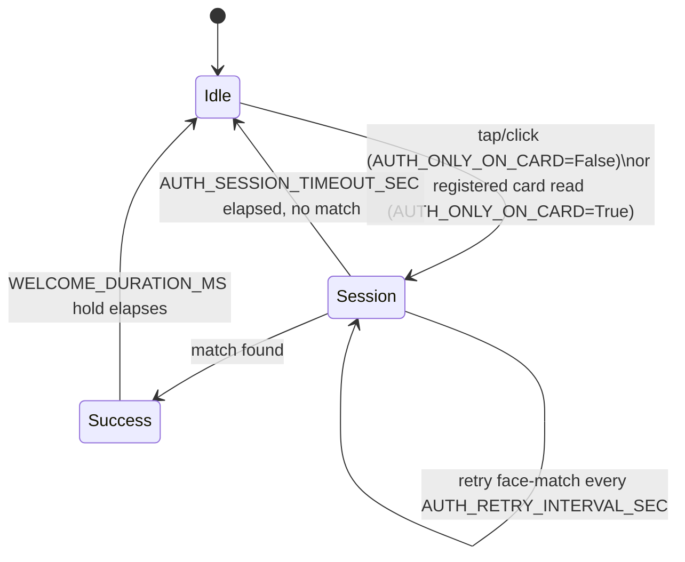
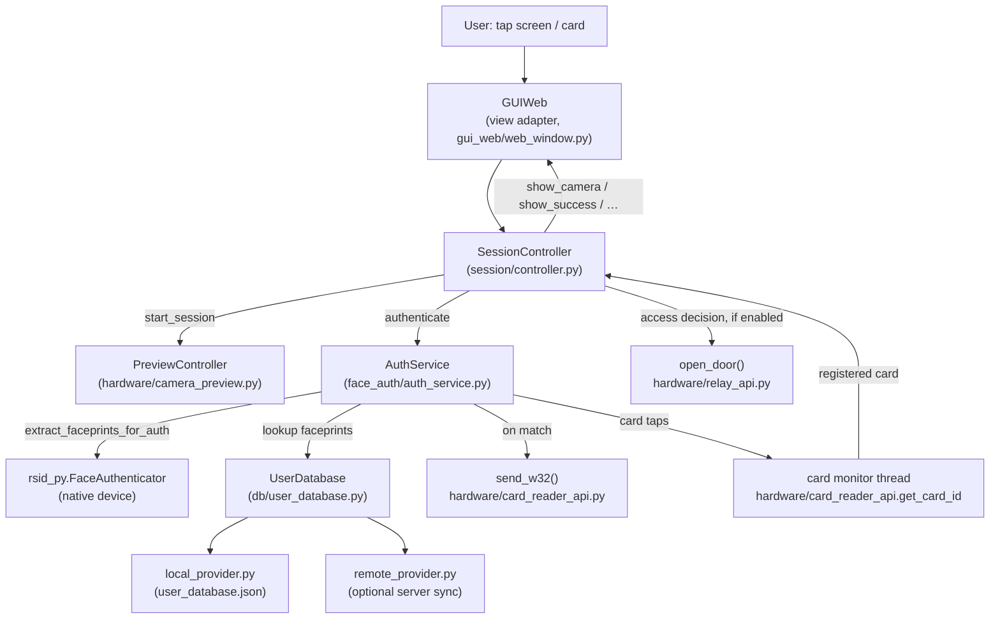

# RSID_Face_Guard — Architecture & Business Logic

Face-authentication access-control kiosk built on the Intel RealSense ID
(F45x) device, running on a Raspberry Pi 5. Recognizes a registered user's
face (optionally combined with a Wiegand card tap), then fires a Wiegand
"card ID" signal and/or opens a door relay.

A single front-end: an embedded web UI (`demo_ui/`) hosted in a QtWebEngine
window, driven by a UI-agnostic session controller (`session/`) that sits on top
of the shared business/hardware layers.

## 1. Module Map

```
main_web.py                  Entry point: device discovery, device config,
                              hardware init, launch the GUI.
config.py                    Single source of truth for all tunables/flags.

face_auth/
  auth_service.py            AuthService -- all authentication business
                              logic (face match, card lookup, card-reader
                              monitoring thread). No GUI/hardware I/O details.

db/
  user_database.py           UserDatabase -- facade the rest of the app uses.
  local_provider.py          Reads/writes user_database.json.
  remote_provider.py         Optional HTTP fetch of users/faceprints by MAC.
  provider_api.py            Shared provider interface.

hardware/
  camera_preview.py          PreviewController -- background thread wrapping
                              rsid_py preview/camera streaming.
  card_reader_api.py         Facade selecting real vs. simulated card backend
                              (config.SIMULATE_CARD_READER); exposes
                              Wiegand reads (get_card_id) and sends (send_w32).
  relay_api.py                Door-strike relay control (GPIO via lgpio).

card_backends_impl/          Concrete card backend implementations selected by
                              hardware/card_reader_api.py (Strategy pattern):
  wiegand_card_reader.py      Real GPIO/lgpio Wiegand reader.
  wiegand_card_writer.py      Real GPIO/lgpio Wiegand transmitter.
  card_read_write_simulator.py Simulated card reader/writer for dev off-Pi.

session/                      The session state machine, UI- and hardware-
                              agnostic (no Qt / rsid_py import) so it is
                              testable off-device -- see session/tests/.
  controller.py               SessionController -- session lifecycle, timers,
                              card/tap triggers, auth dispatch, access decision.
  view.py                     SessionView protocol the front-end implements.
  scheduler.py                Timer abstraction (Qt timers in production, a
                              manual clock in tests).

gui_web/
  web_window.py               GUIWeb -- QWebEngineView window hosting the web
                              UI; implements SessionView and adapts Qt timers,
                              signals and the JS bridge for the controller.
  display_utils.py            Small-display geometry detection helper.
  frame_server.py             CameraStreamer (MJPEG) + WebServer (serves
                              demo_ui/ over loopback HTTP).

demo_ui/                      Static HTML/CSS/JS front-end rendered inside
                              GUIWeb's QWebEngineView (designer-provided UI).

qr_scanner/
  qr_scanner.py               QRScanner -- OpenCV QR detection plus Ed25519
                              signature, expiry and nonce-replay verification
                              against provisioning_keys/*.pem.

provisioning/                 Binding this device to a dashboard server after
                              it scans a provisioning QR (see server/README.md):
  binding.py                  BindingManager -- the flow the GUI calls.
  client.py                   The two HTTP calls (register, post_status).
  identity.py                 Load/save device_identity.json (holds a token).
  heartbeat.py                Background status-reporting thread.

server/                       Standalone FastAPI + SQLite dashboard. Issues the
                              provisioning QRs and displays device status. Not
                              part of the device app -- deploys separately.
```

The GUI depends only on `SessionController`, `AuthService`,
`PreviewController` and `config` -- it never talks to `rsid_py`, GPIO or the DB
directly.

## 2. Startup Flow (`main_web.py`)

1. Parse CLI args (`--port`, `--camera`).
2. `rsid_py.discover_devices()` -- auto-detect the serial port, falling back
   to `/dev/ttyACM0` (or `COM9` on Windows) if none found.
3. `rsid_py.discover_device_type(port)` -- identify F45x/F46x.
4. Open a short-lived `FaceAuthenticator` session just to disable dump mode
   on the device, then disconnect.
5. If `config.AUTH_ONLY_ON_CARD`: initialize the card reader.
6. If `config.RUN_WITH_RELAY`: initialize the relay (GPIO pin, active-low).
7. Construct the Qt `QApplication`, create the `GUIWeb` window, `.show()` it,
   install SIGINT/SIGTERM handlers for a clean, ordered shutdown (with a
   watchdog force-exit), and run the Qt event loop.

## 3. Core Business Logic — `AuthService`

`face_auth/auth_service.py` owns all authentication logic and is fully
GUI-agnostic (no Qt import). It **recognises**; it does not decide access -- the
`SessionController` makes the access decision and drives the relay (see §4).
Constructed once per app run with the serial port; owns:

- `self._authenticator` -- the `rsid_py.FaceAuthenticator` connection.
- `self.user_db` -- a `UserDatabase` instance (local JSON, optionally synced
  from a remote server).
- Wiegand transmitter init (`initialize_wiegand_tx`).
- Optional background card-reader-monitoring thread.

### Two authentication modes

- **`authenticate_face_only()`** (used when `AUTH_ONLY_ON_CARD=False`) --
  extracts one live faceprint from the camera, then matches it against
  *every* user in the DB, picking the highest-scoring match above threshold.
- **`authenticate_with_card_and_face(card_id)`** (used when `AUTH_ONLY_ON_CARD=True`)
  -- looks up the tapped card's user record directly, then only needs to
  match the live faceprint against that *one* user's stored faceprint.

### Match decision

`rsid_py`'s `match_faceprints()` returns a `match_result` with:
- `.success` -- the native SDK's own adaptive strong-threshold decision.
- `.score` -- raw integer score.

The app additionally accepts a match if `score >= config.CUSTOM_THRESHOLD`
even when `.success` is `False` (a looser fallback -- see `config.py`'s
comment for current tuning guidance).

### On successful match

1. `send_w32(card_id_or_user_id)` -- fires the Wiegand transmit signal
   (`hardware/card_reader_api.py`), letting an external access-control panel
   treat this as a normal card swipe.
2. Emit `auth_matched` (a decision breadcrumb only) and expose the matched
   `last_user_id`.
3. Return `(True, name, permission_level)` to the caller.

The relay is **not** opened here. The `SessionController` receives the match,
pulses the door off the UI thread, and only then emits `access_granted` -- or
`access_output_failed` if the strike will not open (fail-secure).

### Card-reader monitoring thread

`start_card_monitoring(on_card_detected)` runs a lightweight polling loop
(`hardware/card_reader_api.get_card_id`) that:
- Ignores unregistered cards immediately (fast DB-only check via
  `card_is_registered`) -- no camera spin-up for a card that can never
  succeed.
- Applies a cooldown per card ID to avoid re-triggering on a held tap.
- Skips reads while `mark_card_session_active()` has been called by the GUI
  (i.e. a session driven by this card is already in progress), until
  `mark_card_session_done()`.
- Reports registered card taps via a callback -- the GUI marshals this back
  onto its own thread and starts a session.

## 4. Session State Machine (`session/controller.py`)

The camera preview is **off while idle** and only turns on for a bounded
"session". This avoids the periodic camera-restart stutter that a fixed-
interval always-on auto-auth design would cause (the RealSense hardware
can't stream a live preview and run authentication simultaneously -- any
auth attempt briefly restarts the UVC stream).



Trigger path depends on `config.AUTH_ONLY_ON_CARD`:
- **`False`** (default) -- any tap/click anywhere on the window/page starts
  a session with no `card_id` (`authenticate_face_only()` runs each retry).
- **`True`** -- only a registered card tap (detected by the background
  monitoring thread) starts a session bound to that `card_id`
  (`authenticate_with_card_and_face()` runs each retry).

### `start_session(card_id=None)`
1. Mark session active; if card-triggered, call
   `host_service.mark_card_session_active()` (blocks the monitor thread from
   re-triggering mid-session).
2. Resume the camera preview (`PreviewController.resume()`).
3. Start a repeating retry timer (`AUTH_RETRY_INTERVAL_SEC`) that calls
   `authenticate()` if no auth is already in flight; fire the first attempt
   after a short preview lead-in (`PREVIEW_LEAD_IN_MS`, default 700 ms) so live
   frames reach the screen before the SDK takes the camera.
4. Start a one-shot session timeout timer (`AUTH_SESSION_TIMEOUT_SEC`).

### `authenticate()` (runs on a background thread)
1. Pause the preview stream (camera can't stream + authenticate at once).
2. Call the appropriate `AuthService` method.
3. Emit the result back to the Qt main thread via a `Signal`
   (`_SignalBridge`), since UI updates must happen on the main thread.
4. If the session is still active, resume the preview for the next retry.

### On success (`_on_auth_complete`)
1. Stop the retry/timeout timers immediately (prevents a stray retry firing
   during the welcome hold).
2. Pulse the relay (if enabled), then show a "Welcome, `<name>`" screen via
   `SessionView.show_success()` -- `deviceUI.success()` over the JS bridge.
3. After `WELCOME_DURATION_MS`, end the session (pause preview, clear card
   session flag, return to idle).

### On timeout (`_session_timeout`)
End the session silently -- no failure UI shown, just back to idle/
screensaver, ready for the next tap or card read.

## 5. The Web UI Front-End (`gui_web` + `demo_ui`)

`GUIWeb` is a thin view adapter over `SessionController`. Its whole job is to
translate between Qt/browser plumbing and the controller's two protocols
(`SessionView`, scheduler):

| Concern | How `gui_web` does it |
|---|---|
| Rendering | `QWebEngineView` loads `demo_ui/index.html`; camera frames are served as an MJPEG stream over loopback HTTP and shown in an `` tag (the browser engine cannot open the RealSense camera itself) |
| Camera transport | `CameraStreamer` + `WebServer` (`gui_web/frame_server.py`) re-serve `PreviewController` frames as MJPEG on the same origin as the page |
| Trigger input | JS `click` listener over the `QWebChannel` bridge → `pyBridge.userTapped()` → `SessionController.on_user_tapped()` |
| Screen changes | `SessionView` methods map to `deviceUI.success()/failed()/screensaver()/…` JS calls (`demo_ui/app.js`) |
| Timers | Qt `QTimer`s injected through the `session/scheduler.py` abstraction, so tests can swap in a manual clock |
| Thread marshalling | Auth runs on a worker thread; results return to the UI thread via `_SignalBridge` Qt signals |
| Keypad | `demo_ui` ships a demo keypad code path (`Bridge.codeSubmitted`), separate from face auth and with no authorisation effect |

Because the state machine itself lives in `session/`, adding another front-end
means implementing `SessionView` -- not reimplementing the session logic. The
former Qt-widgets front-end (`gui_qt/`, `main_qt.py`) was removed on 2026-08-31.

## 6. Data Flow Diagram



## 7. Key Config Flags (`config.py`)

| Flag | Purpose |
|---|---|
| `DB_MODE` | `"local"` = JSON file only; `"remote"` = periodic server sync into local cache |
| `SIMULATE_CARD_READER` | Use simulated card reader/relay (dev off-Pi) |
| `AUTH_ONLY_ON_CARD` | `False` = tap-anywhere triggers auth against all users; `True` = only a registered card tap triggers auth against that user |
| `AUTH_RETRY_INTERVAL_SEC` / `AUTH_SESSION_TIMEOUT_SEC` | Session retry cadence and max session duration |
| `KIOSK_BORDERLESS` | Fullscreen/frameless kiosk window vs. bordered debug window |
| `CUSTOM_THRESHOLD` | Fallback raw score threshold for accepting a match when the SDK's own `.success` is `False` |
| `RUN_WITH_RELAY`, `RELAY_PIN`, `RELAY_ACTIVE_LOW` | Door-strike relay GPIO config |
| `WINDOW_WIDTH` / `WINDOW_HEIGHT` | Kiosk display resolution (e.g. 720x720 for the small touch screen) |
| `WEB_UI_DIR`, `WEB_FRAME_PORT` | Web front-end assets directory and MJPEG/HTTP loopback port |
| `WELCOME_DURATION_MS` / `FAIL_DURATION_MS` | How long success/failure overlays are shown |