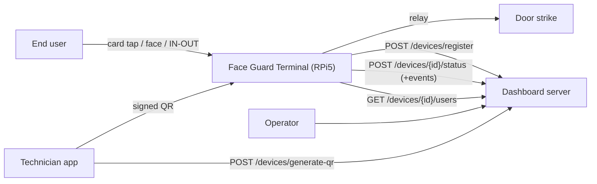
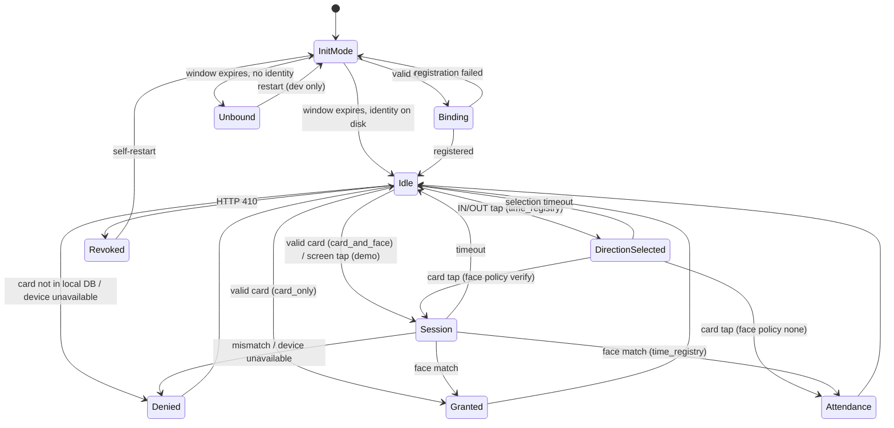
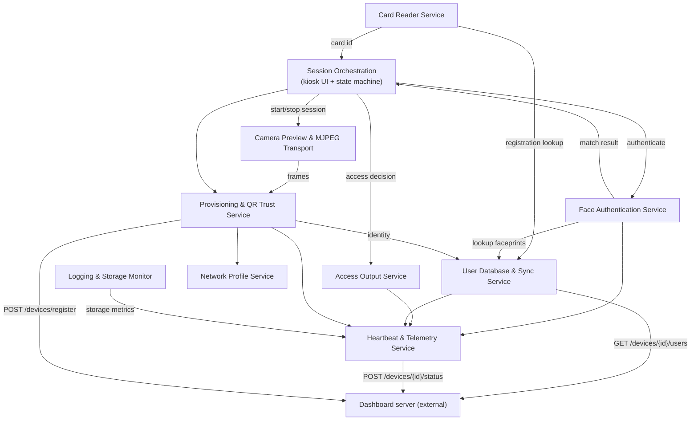
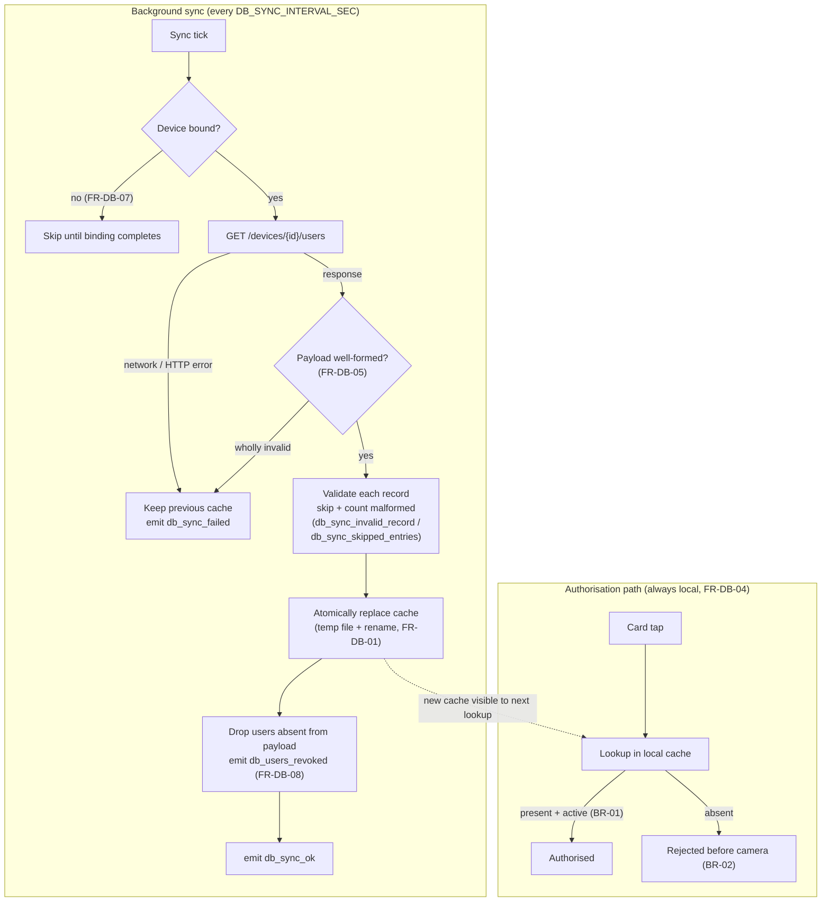
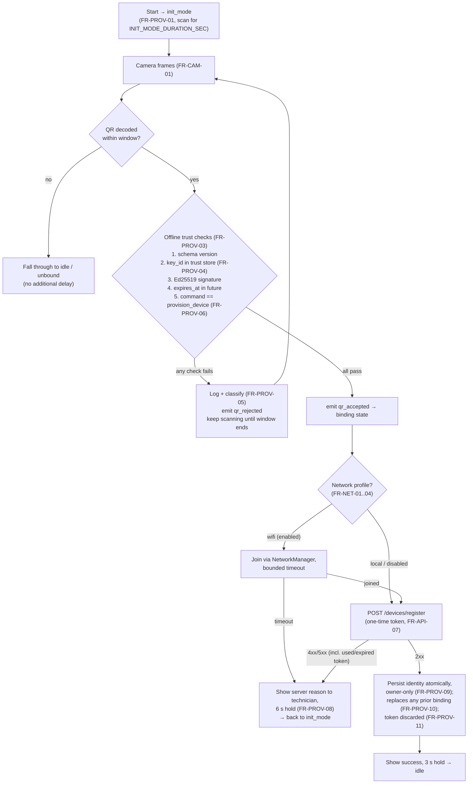

# RSID Face Guard — Software Requirements Specification

**Access Control & Time-Registry Edge Terminal**

| Item | Detail |
|---|---|
| Document ID | SRS-FG-001 |
| Revision | 1.4 |
| Product | RSID Face Guard kiosk application |
| Target platform | Raspberry Pi 5, 720×720 round touch display |
| Biometric device | Intel RealSense ID F45x (`rsid_py` SDK) |
| Front-end | **Web UI — the only one** (`main_web.py` → `session/` + `gui_web/` + `demo_ui/`) |
| Server | External dashboard server; only the device-facing REST contract is in scope |
| Status | Baselined |

---

## 1. Purpose, Scope and Conventions

### 1.1 Purpose

This document specifies the software requirements for the RSID Face Guard edge
terminal: a Raspberry Pi 5 kiosk that identifies an end user by RFID card and/or
face, opens a door via a relay, registers working-hours (in/out) events, and
reports its state to a central dashboard server.

It is written as a pre-implementation specification: it defines *what* the
device shall do and the contracts it depends on. [Section 11](#11-traceability) maps every
requirement onto the delivered modules.

### 1.2 Scope

**In scope**

- The kiosk application and all of its device-side services.
- The **web UI** front-end — the sole front-end: a QtWebEngine kiosk hosting
  `demo_ui/`, driven by the UI-agnostic session controller in `session/`.
- Provisioning by signed QR code, and the device↔server REST contract.
- Local user/faceprint storage, offline operation, telemetry and logging.

**Out of scope**

- Server implementation, dashboard pages, database and operator workflows.
  The server is specified here **only** by the endpoints the device calls
  ([§8](#8-external-interfaces)), to be implemented by the server team on request.
- Alternate front-ends. The Qt-widgets harness (`main_qt.py`, `gui_qt/`) was
  **removed from the repository on 2026-08-31**; `main_web.py` is the only entry
  point. Note that PySide6/QtWebEngine remains a *runtime dependency* of the web
  UI — it is the browser engine host, not a second front-end.
- Technician mobile application internals.

### 1.3 Conventions

- **Shall** = mandatory. **Should** = recommended. **May** = optional.
- Requirements are numbered `FR-<AREA>-nn` and `NFR-nn`.
- Timestamps exchanged with the server use UTC, `%Y-%m-%dT%H:%M:%SZ`.
- Requirements marked **[NEW]** are not in the current build and are specified
  here as required behaviour (see [§12](#12-assumptions-known-deviations-and-future-work), Known Deviations).

### 1.4 Definitions

| Term | Meaning |
|---|---|
| Terminal / device | The RPi5 kiosk running this software |
| Faceprint | Feature vector produced by the RealSense ID SDK, stored per user |
| Binding / provisioning | Associating a terminal with a server, customer, site and door by scanning a signed QR |
| Init mode | The terminal's **entry state**: a bounded window, entered on every start, in which it scans for a provisioning QR ([FR-PROV-01](#fr-prov-01)) |
| Idle screen | What the UI shows in `idle` — the screensaver in card modes, the IN/OUT selection screen in `time_registry` |
| Session | A bounded authentication attempt window with the camera active |
| Revocation | Server-initiated removal of a terminal (HTTP 410) |
| Door DB | The per-device user set the server sends to this terminal |

---

## 2. System Context

### 2.1 Actors

| Actor | Interaction |
|---|---|
| End user | Taps a card, presents their face, selects IN/OUT |
| Technician | Provisions the terminal by showing a signed QR from the technician app |
| Dashboard operator | Creates doors, assigns users, removes (revokes) devices |
| Dashboard server | Issues QRs, registers devices, serves the door DB, receives status and events |

### 2.2 Hardware

| Component | Purpose |
|---|---|
| Raspberry Pi 5 | Application host |
| 720×720 round touch display | Kiosk UI, tap input |
| Intel RealSense ID F45x | Face capture and matching, and QR image source |
| Card reader | GWIOT USB-HID (production), Wiegand GPIO (legacy), simulated (dev) |
| Relay (GPIO 18) | Door strike |
| Network | Ethernet or Wi-Fi (Wi-Fi may be joined from the provisioning QR) |

### 2.3 Context diagram



---

## 3. Operating States



**Connectivity is orthogonal to the operating state.** Server reachability is
an *attribute* of a bound terminal, not a state of its own: a terminal with a
valid local database performs the full access flow — card read, face
verification, authorisation, relay, attendance capture — identically whether
or not the server is reachable. Losing the network changes only what the
terminal can *report* and how fresh its data is, never what it can *decide*.


| State | Behaviour |
|---|---|
| `init_mode` | **The entry state.** Hardware discovery and initialisation, then a live preview scanning for a provisioning QR for a bounded window. Entered on every start, whether or not the terminal is already bound, so a technician can re-provision ([FR-PROV-10](#fr-prov-10)). Only the *duration* is configurable: `INIT_MODE_ENABLED = false` is equivalent to a zero-length window that falls straight through to `idle` (or `unbound` if no identity) |
| `binding` | QR accepted; network profile applied and registration in flight |
| `unbound` | **Development/debug only** — a production terminal is not usable until bound. No identity; no server sync; QR instruction shown. Does not scan; a restart re-enters `init_mode` |
| `idle` | Screensaver; card monitor armed; heartbeat running |
| `direction_selected` | `time_registry` only: IN or OUT latched, awaiting a card tap or selection timeout |
| `session` | Camera on, face match retried |
| `granted` / `denied` | Result screen for a fixed hold |
| `attendance` | `time_registry` only: direction registered, result screen for a fixed hold, **no relay** |
| `revoked` | Transient. Identity dropped, **local user DB purged, all access denied**, then orderly self-restart ([FR-HB-10](#fr-hb-10)) |

| Connectivity attribute | Effect |
|---|---|
| `server_online` | Heartbeats acknowledged, events drained, DB refreshed on schedule |
| `server_offline` | **Access flow unchanged**; events accumulate; DB stays at its last good version; retries back off. The UI may show a small offline indicator |


<a id="fr-state-01"></a>**FR-STATE-01** The terminal shall persist its binding across restarts and
resume `idle` without operator action.

<a id="fr-state-02"></a>**FR-STATE-02** In `remote` database mode the terminal shall never grant access
in `unbound` or `revoked` state. In `local` database mode the terminal
authorises from its local file and the binding states do not apply: an
unprovisioned `local` terminal is a valid, fully functional configuration.

<a id="fr-state-03"></a>**FR-STATE-03** A state transition shall never interrupt an in-flight
authentication; background work shall not pre-empt a session.

### 3.1 Offline operation

<a id="fr-state-04"></a>**FR-STATE-04** A bound terminal holding a valid local database shall perform
the **complete** access flow while the server is unreachable, in every
operating mode: card lookup, 1:1 face verification, the authorisation
decision, relay actuation and IN/OUT attendance capture. Offline operation is
normal operation, not a reduced mode.

<a id="fr-state-05"></a>**FR-STATE-05** No door decision shall ever depend on a live server call: all
lookups read the local cache ([FR-DB-04](#fr-db-04)). A failed sync shall never clear,
expire or invalidate the cached user set.

<a id="fr-state-06"></a>**FR-STATE-06** *DEPRECATED (rev 1.2) — merged into [FR-STATE-05](#fr-state-05).*

<a id="fr-state-07"></a>**FR-STATE-07** Events generated offline shall be retained and delivered once
connectivity returns, per the buffering rules of [§5.8](#58-heartbeat--telemetry-service) ([FR-HB-05](#fr-hb-05), [FR-HB-07](#fr-hb-07),
[FR-HB-08](#fr-hb-08)) and the attendance durability rule ([FR-MODE-10](#fr-mode-10)). Reconnection is
automatic; no operator action is required.

<a id="fr-state-08"></a>**FR-STATE-08** *DEPRECATED (rev 1.2) — merged into [FR-STATE-07](#fr-state-07).*

<a id="fr-state-09"></a>**FR-STATE-09** Database synchronisation is **periodic and asynchronous**, not
transactional with access attempts: the local cache may lag the server by up
to one sync interval. A sync failure shall be logged and emitted as an event,
never surfaced on the idle screen; the terminal keeps serving users normally.

<a id="fr-state-10"></a>**FR-STATE-10** *DEPRECATED (rev 1.2) — merged into [FR-STATE-09](#fr-state-09).*

<a id="fr-state-11"></a>**FR-STATE-11** Loss of connectivity shall **not** be treated as revocation.
Only an explicit HTTP 410 triggers the fail-secure purge of [FR-HB-10](#fr-hb-10); an
unreachable server shall never deny access to an otherwise valid user.

<a id="fr-state-12"></a>**FR-STATE-12** *DEPRECATED (rev 1.2) — an optional offline indicator is a UI
nicety, not a requirement; noted in the connectivity table above.*


---

## 4. Device Operating Modes

The terminal supports four mutually exclusive **device modes**.

| Mode | Trigger | Face step | Relay | Event |
|---|---|---|---|---|
| `card_only` | Valid card tap | **skipped** | opens | `access_granted` |
| `card_and_face` | Valid card tap | 1:1 verify against cardholder | opens on match | `access_granted` / `access_denied` |
| `face_only` | Screen tap | 1:N identify | opens on match | `access_granted` / `access_denied` |
| `time_registry` | End user selects IN or OUT, then taps card | per [§4.3](#43-time-registry-mode-new) face policy | **no door output** | `attendance_event` |

### 4.1 Mode selection and common rules

<a id="fr-mode-01"></a>**FR-MODE-01** The mode shall be provisioned **per door by the server**,
returned in the registration response. `config.py` shall hold only an
install-time fallback default. Retuning via the heartbeat response is future
work ([§12.3](#123-out-of-scope-for-this-release)). *(Assumption [A1](#a1).)*

<a id="fr-mode-02"></a>**FR-MODE-02** In every mode, a card that is not present in the local door DB
shall be rejected **before the camera is started** ([BR-02](#br-02)).

### 4.2 Card and face modes

<a id="fr-mode-03"></a>**FR-MODE-03 `card_only`** — on a valid card the terminal shall open the relay
immediately, with no face step. The decision path is
`Card Reader → Session Orchestration → Access Output`; the Face Authentication
Service is not involved and no session or camera preview is started. **[NEW]**

<a id="fr-mode-04"></a>**FR-MODE-04 `card_and_face`** — on a valid card the terminal shall start a
session and verify the live face 1:1 against that cardholder's stored
faceprints only. This is the default production mode.

<a id="fr-mode-05"></a>**FR-MODE-05 `face_only`** — a screen tap shall start a face-only
(1:N) session that identifies the presented face against all active enrolled
users, opening the relay on a match. This mode is intended for doors with **no
card reader fitted**; the card reader is neither initialised nor used.
*(Revised rev 1.5: promoted from a demo-only configuration to a fourth
first-class device mode.)*

### 4.3 Time-registry mode **[NEW]**

Working-hours journalling: the end user declares direction, then identifies.

The **face policy** referenced below is an explicit per-door setting with
exactly two values, provisioned alongside `device_mode` ([FR-MODE-01](#fr-mode-01)).
*(Confirmed decision — see [A6](#a6).)*

| Face policy | Behaviour on card tap |
|---|---|
| `none` | The card alone registers the direction; no session, no camera |
| `verify` | A session is started and the live face is verified 1:1 against the cardholder, exactly as in `card_and_face`; a mismatch registers nothing |

<a id="fr-mode-06"></a>**FR-MODE-06** The terminal shall present an IN/OUT selection screen in place
of the screensaver. The selection shall be latched until the following card
tap completes, or until `DIRECTION_SELECT_TIMEOUT_SEC` elapses, at which point
the UI shall return to the idle screen with nothing registered.

<a id="fr-mode-07"></a>**FR-MODE-07** After a direction is selected and a registered card is tapped,
the terminal shall perform the identification defined by the configured face
policy (`none` or `verify`, above) and, on success, emit an
`attendance_event` carrying `user_id` ([FR-DATA-06](#fr-data-06)), `direction` (`in`/`out`)
and the UTC timestamp.

<a id="fr-mode-08"></a>**FR-MODE-08** In `time_registry` the terminal shall **not** actuate the
relay. *(Assumption [A2](#a2); combined access+attendance is a future extension.)*

<a id="fr-mode-09"></a>**FR-MODE-09** Attendance events shall be delivered over the same
buffered-event channel as all other events ([§9](#9-data-model)), with `event_id` idempotency.

<a id="fr-mode-10"></a>**FR-MODE-10** Attendance events **shall** be queued **durably on disk**
rather than in the volatile buffer of [§9](#9-data-model): losing a check-in is a payroll
error, not a lost telemetry line.

<a id="fr-mode-11"></a>**FR-MODE-11** Server-side handling of attendance events: see
[FR-API-15](#fr-api-15).


---

## 5. Service Architecture

The application is decomposed into the following cooperating services. Each
runs in the single kiosk process; long-running work is on background threads
so the UI thread is never blocked.



The access decision is owned by Session Orchestration, never by the Face
Authentication Service ([FR-FACE-04](#fr-face-04)); in `card_only` the path is `CR → UI → AO`
with no biometric stage. DB sync and heartbeating are independent HTTP paths
on separate schedules; events piggyback on the heartbeat ([FR-HB-04](#fr-hb-04)), the door
DB does not.

### 5.1 Session Orchestration Service

Owns the kiosk window, the UI state machine and the lifecycle of every
authentication session.

The state machine itself is **UI-agnostic**: it lives in `session/controller.py`
and drives the front-end through the `SessionView` protocol (`session/view.py`)
and a scheduler abstraction (`session/scheduler.py`), so it holds no Qt, browser
or `rsid_py` dependency. `gui_web/web_window.py` is the view adapter and platform
glue that implements those protocols.

<a id="fr-sess-01"></a>**FR-SESS-01** The service shall host the web UI full-screen in kiosk mode and
serve its assets and the camera stream over a loopback HTTP origin so the page
and the stream are same-origin.

<a id="fr-sess-02"></a>**FR-SESS-02** The camera preview shall be **off while idle** and shall be
started only for the duration of a session, to avoid a permanently streaming
camera and its associated restart stutter.

<a id="fr-sess-03"></a>**FR-SESS-03** A session shall be started by a valid card tap (card modes) or
a screen tap (`face_only`), and never while a session or init mode is
already active. A **different** valid card presented during a result-screen
hold shall pre-empt the result and start a new session ([BR-04](#br-04)).

<a id="fr-sess-04"></a>**FR-SESS-04** During a **`face_only` session** the service shall retry
face matching every `AUTH_RETRY_INTERVAL_SEC` until a match succeeds or
`AUTH_SESSION_TIMEOUT_SEC` elapses. In card-triggered modes the session ends
on the **first** conclusive mismatch, per [BR-05](#br-05); retrying is not performed
because the identity to verify against is already known from the card.

<a id="fr-sess-05"></a>**FR-SESS-05** Only one authentication attempt shall be in flight at a time;
a retry tick arriving while an attempt runs shall be skipped.

<a id="fr-sess-06"></a>**FR-SESS-06** On success the service shall stop all session timers
immediately, before showing the result, so no further attempt can fire during
the result hold.

<a id="fr-sess-07"></a>**FR-SESS-07** Authentication shall run on a worker thread and its result
shall be marshalled back onto the UI thread for rendering.

<a id="fr-sess-08"></a>**FR-SESS-08** On session end the service shall pause the preview, clear any
card-session flag and return to the idle screen ([§1.4](#14-definitions)).

### 5.2 Face Authentication Service

Encapsulates all biometric business logic; contains no UI or transport code.

<a id="fr-face-01"></a>**FR-FACE-01** The service shall connect to the RealSense ID device over its
serial port at startup and expose 1:1 (card-bound) and 1:N (face-only)
authentication operations.

<a id="fr-face-02"></a>**FR-FACE-02** For 1:1, the live faceprint shall be matched **only** against
the faceprints stored for the cardholder.

<a id="fr-face-03"></a>**FR-FACE-03** A match shall be accepted when the SDK reports success **or**
when the returned score is greater than or equal to `CUSTOM_THRESHOLD`
(a RealSense ID SDK native-score parameter). This

score fallback shall be configurable and its value recorded in the decision
log.

<a id="fr-face-04"></a>**FR-FACE-04** Identification and the access decision shall be distinct
stages: a biometric match alone shall not actuate the door.

<a id="fr-face-05"></a>**FR-FACE-05** Failure to extract a faceprint, absence of stored faceprints
for the user, and a score below threshold shall each produce a distinct,
logged denial reason.

<a id="fr-face-06"></a>**FR-FACE-06** On an SDK/hardware exception the service shall block further
authentication for a backoff period (20 s), start a background reconnect, and
report a `hardware_error` event. The internal cause shall not be shown to the
user, but the condition shall be surfaced to the UI as a distinct
"temporarily unavailable" outcome ([FR-UI-12](#fr-ui-12)) — a user standing at the door
after a card tap shall never be left without feedback.

<a id="fr-face-07"></a>**FR-FACE-07** The service shall never grant access as a result of an internal
error; all error paths shall be fail-secure.


### 5.3 Card Reader Service

<a id="fr-card-01"></a>**FR-CARD-01** The service shall abstract the reader behind a single interface
and select one backend by configuration: GWIOT USB-HID (production), Wiegand
GPIO (legacy), or a simulator for development off the Pi.

<a id="fr-card-02"></a>**FR-CARD-02** A background monitor thread shall poll for card reads and
notify the session service; polling shall never block the UI thread.

<a id="fr-card-03"></a>**FR-CARD-03** The monitor shall suppress a repeated read of the **same** card
within a cooldown window (2 s) to prevent duplicate sessions from one physical
tap.

<a id="fr-card-04"></a>**FR-CARD-04** The monitor shall skip reads entirely while a card-triggered
session is **in progress**, and resume the moment that session ends. The
result-screen hold that follows a session is **not** part of the session for
this purpose: reads resume during the hold, so a different card can pre-empt
it ([BR-04](#br-04), [FR-SESS-03](#fr-sess-03)).

<a id="fr-card-05"></a>**FR-CARD-05** The monitor shall check card registration against the local DB
(a fast, camera-free lookup) and shall report registered and unregistered
cards through separate callbacks.

<a id="fr-card-06"></a>**FR-CARD-06** A reader exception shall be logged, reported as a hardware
error event, and followed by a retry delay; it shall not terminate the monitor
thread or the application.

### 5.4 Access Output Service

<a id="fr-out-01"></a>**FR-OUT-01** The relay shall be the sole access output. It shall be driven on
a configurable GPIO pin with configurable active-low polarity and a defined
default-off state at startup.

<a id="fr-out-02"></a>**FR-OUT-02** On an approved decision the relay shall be pulsed for the
activation duration, asynchronously, so the UI result is not delayed by the
pulse. The duration uses the relay driver's built-in default (currently 3 s
in `relay_api.open_door`); no separate configuration parameter is required.

<a id="fr-out-03"></a>**FR-OUT-03** Relay actuation shall emit a `relay_opened` event.

<a id="fr-out-04"></a>**FR-OUT-04** Wiegand-transmitter initialisation failure shall be non-fatal.
(The external-controller output mode itself is out of scope, [§12.3](#123-out-of-scope-for-this-release).)

<a id="fr-out-05"></a>**FR-OUT-05** If the relay is disabled or fails to initialise, the terminal
shall continue to operate and log the condition, degrading gracefully rather
than exiting.

<a id="fr-out-06"></a>**FR-OUT-06** An approved decision followed by an output failure shall be
recorded distinctly from a denial.

### 5.5 User Database & Sync Service

The sync cycle ([FR-DB-03](#fr-db-03), [FR-DB-05](#fr-db-05), [FR-DB-08](#fr-db-08)) is fully decoupled from the
authorisation path ([FR-DB-04](#fr-db-04)): the left side can fail forever without the
right side ever noticing.



<a id="fr-db-01"></a>**FR-DB-01** The local database shall hold, per user: badge/card id, stable
`user_id`, display name, `active` flag, permission level and a list of zero or
more faceprints, persisted as a local JSON store and written atomically (temp
file + rename) so a power cut cannot leave a truncated file. No in-place
schema migration is required: a cache file in an older schema shall simply be
discarded at startup and repopulated by the next successful sync — the server
is the master copy of every record.

<a id="fr-db-02"></a>**FR-DB-02** The database shall be the **single authority for authorisation**:
the server sends only the users relevant to this device's door, therefore
**presence of a valid, active record in the local DB constitutes
authorisation**. The `permission_level` field is informational only.

<a id="fr-db-03"></a>**FR-DB-03** In `remote` mode the service shall periodically refresh the local
cache from the server every `DB_SYNC_INTERVAL_SEC`, on a background thread.

<a id="fr-db-04"></a>**FR-DB-04** All authentication lookups shall read the **local cache**, never
the network, so a slow or absent server can never delay a door decision.

<a id="fr-db-05"></a>**FR-DB-05** A sync shall replace the cache only when a well-formed payload
was received; malformed records shall be skipped and counted, and a wholly
invalid response shall leave the previous cache intact.

<a id="fr-db-06"></a>**FR-DB-06** Sync outcomes shall emit `db_sync_ok`, `db_sync_failed`,
`db_sync_invalid_record` or `db_sync_skipped_entries` events as appropriate.

<a id="fr-db-07"></a>**FR-DB-07** If the device is not bound, remote sync shall be skipped until
binding completes.

<a id="fr-db-08"></a>**FR-DB-08** The `GET /devices/{id}/users` payload is a **full replacement
set**, not a delta: the server does not send a removal list. Users present in
the local cache but **absent from a well-formed payload** shall therefore be
dropped locally and `db_users_revoked` emitted. This inference is only valid
for a payload that passed the [FR-DB-05](#fr-db-05) well-formedness check; a malformed or
failed response shall never be interpreted as "all users removed".


### 5.6 Provisioning & QR Trust Service

The provisioning flow, from the init-mode scan window to a persisted identity.
All trust checks ([FR-PROV-03](#fr-prov-03)) run **offline**; the first network call is the
registration itself.



<a id="fr-prov-01"></a>**FR-PROV-01** Init mode is the terminal's entry state: on every start it
shall show a live preview and scan for a provisioning QR for
`INIT_MODE_DURATION_SEC`, whether or not it is already bound. If nothing is
found within the window the terminal shall fall through to `idle`
(or `unbound` when no identity exists) with no additional delay.
Configuration controls only the duration of this
window, not whether it is entered.

<a id="fr-prov-02"></a>**FR-PROV-02** The QR payload shall be a JSON envelope containing at minimum:
`schema`, `command`, `server_url`, `customer_id`, `site_id`, `door_id`,
`provisioning_token`, `issued_at`, `expires_at`, `nonce`, `network_profile`
and a `signature` block (`algorithm`, `key_id`, `value`).

<a id="fr-prov-03"></a>**FR-PROV-03** The terminal shall accept the envelope only if **all** of the
following pass, entirely offline, with no network call required:
schema matches the expected version; the `key_id` resolves to a locally
trusted public key; the Ed25519 signature verifies over the canonical payload;
and `expires_at` is in the future. Replay of an old QR is prevented
**server-side**: the provisioning token is one-time ([FR-API-07](#fr-api-07)), so a replayed
QR passes local checks but fails registration. The terminal does not maintain
a nonce store.

<a id="fr-prov-04"></a>**FR-PROV-04** The terminal shall hold **only public keys**, one PEM per
trusted `key_id`, in a configured trust-store directory. A missing or empty
trust store shall cause all QRs to be rejected.

<a id="fr-prov-05"></a>**FR-PROV-05** Rejections shall be logged with an outcome line and classified:
benign rejections (wrong schema, expired) at warning level; potential forgery
(bad signature, unknown key) at error level with a
`SECURITY:` marker. A rejected QR shall emit `qr_rejected`; an accepted one
`qr_accepted`.

<a id="fr-prov-06"></a>**FR-PROV-06** Only the `provision_device` command shall be accepted in this
release. The envelope shall remain extensible for future commands, but no
factory-reset or maintenance command shall be honoured. *(Per decision: bind
and revoke only.)*

<a id="fr-prov-07"></a>**FR-PROV-07** On a valid QR the terminal shall apply any network profile
([§5.7](#57-network-profile-service)), then register with the server, on a background thread, never blocking
the UI.

<a id="fr-prov-08"></a>**FR-PROV-08** The registration result shall be displayed to the technician;
a failure shall remain visible longer than a success so the reason can be
read, and shall surface the server's reason rather than a bare status code.

<a id="fr-prov-09"></a>**FR-PROV-09** The identity returned by the server (device id, bearer token,
server URL, customer/site/door, heartbeat interval) shall be persisted
atomically and treated as a credential: owner-readable only and excluded from
version control.

<a id="fr-prov-10"></a>**FR-PROV-10** Re-scanning a QR on an already-bound terminal shall **replace**
the existing binding, so a technician can move a terminal to another door
without a separate reset step.

<a id="fr-prov-11"></a>**FR-PROV-11** The provisioning token shall be one-time; it shall not be
retained after a successful registration.

### 5.7 Network Profile Service

<a id="fr-net-01"></a>**FR-NET-01** A QR may carry a network profile of mode `local` (already
cabled) or `wifi` (with SSID and password).

<a id="fr-net-02"></a>**FR-NET-02** When enabled by configuration, a `wifi` profile shall cause the
terminal to join that network via NetworkManager **before** registering, so a
terminal with no cable can come online from the QR alone.

<a id="fr-net-03"></a>**FR-NET-03** A `local` profile, or the feature being disabled, shall be a
no-op. The feature shall default to disabled so a developer machine is never
reconfigured.

<a id="fr-net-04"></a>**FR-NET-04** Joining shall be bounded by a timeout; failure shall be reported
as a registration failure with a clear message.

<a id="fr-net-05"></a>**FR-NET-05** The Wi-Fi password is signed but **not encrypted** inside the
QR. This shall be documented as an accepted risk: anyone photographing the QR
can read it, so QR validity windows shall be kept short.


### 5.8 Heartbeat & Telemetry Service

<a id="fr-hb-01"></a>**FR-HB-01** A bound terminal shall POST its status to the server every
`heartbeat_interval_sec` (server-supplied at registration, default 30 s) on a
background thread.

<a id="fr-hb-02"></a>**FR-HB-02** Each heartbeat shall carry a status string and a metadata object
including application version, session activity, storage metrics and any
buffered events.

<a id="fr-hb-03"></a>**FR-HB-03** Notable occurrences shall be recorded as **events** in a
thread-safe, bounded, in-memory ring buffer. `emit()` shall be callable from
any thread and shall never block or raise — telemetry must never be able to
break the door.

<a id="fr-hb-04"></a>**FR-HB-04** Events shall not use their own connection: they shall piggyback
on the heartbeat.

<a id="fr-hb-05"></a>**FR-HB-05** Events shall be removed from the buffer **only after** a
successful (2xx) heartbeat, and shall be removed **by `event_id`**, never by
position — the ring may evict entries while a beat is in flight. A failed beat
shall leave the listed events buffered for the next one.

<a id="fr-hb-06"></a>**FR-HB-06** Each event shall carry a UUID `event_id` so the server can
deduplicate idempotently if a beat is delivered but its response is lost.

<a id="fr-hb-07"></a>**FR-HB-07** The buffer shall be capped (200 events, drop-oldest) so a long
outage cannot grow memory without bound on an SD-card-backed kiosk. Loss of
the oldest events under sustained outage is an accepted limitation.

<a id="fr-hb-08"></a>**FR-HB-08** On a transient failure the interval shall back off
exponentially up to a maximum, and reset to the normal interval on the first
success.

<a id="fr-hb-09"></a>**FR-HB-09** On shutdown the terminal shall emit `device_shutdown` and make a
single best-effort synchronous flush of buffered events. Shutdown shall never
be blocked by the network.

<a id="fr-hb-10"></a>**FR-HB-10 (Revocation — fail-secure)** On HTTP **410** the terminal shall
treat the device as removed and shall, in this order:
1. emit `device_revoked` and make one best-effort synchronous flush of the
   buffered events ([FR-HB-09](#fr-hb-09)), **before** the credential is destroyed, so the
   transition is auditable server-side;
2. stop heartbeating;
3. delete the stored identity, so a restart cannot silently rebind;
4. **purge the local user database**, including all faceprints ([FR-DATA-02](#fr-data-02));
   the server is the master copy and the first sync after re-provisioning
   restores the set;
5. **deny all access** from that point on;
6. perform an orderly self-restart under the supervising systemd service
   ([NFR-21](#nfr-21)), so the terminal re-enters `init_mode` and a technician can
   re-provision it by presenting a new QR without a power cycle.

Revocation is equivalent to a reset. **[NEW]** — see [§12](#12-assumptions-known-deviations-and-future-work).

> Steps 1–5 are implemented as specified. **Step 6 is not**: the build returns to
> `init_mode` in-process instead of restarting. Recorded as [D21](#d21).

### 5.9 Logging & Storage Monitor

<a id="fr-log-01"></a>**FR-LOG-01** All modules shall log through one shared logger tree writing to
console and a size-limited rotating file, with a global level and per-module
overrides configurable without code changes.

<a id="fr-log-02"></a>**FR-LOG-02** Native SDK log output shall be bridged into the same logger so
device-level diagnostics land in one place.

<a id="fr-log-03"></a>**FR-LOG-03** Security-relevant outcomes (QR accept/reject, access decisions,
binding, revocation) shall always be logged regardless of module verbosity.

<a id="fr-log-04"></a>**FR-LOG-04** Secrets shall never be written to logs: bearer tokens, Wi-Fi
passwords, private keys and raw faceprint vectors.

<a id="fr-log-05"></a>**FR-LOG-05** Free disk space shall be checked periodically; crossing below a
configured minimum shall log a warning and emit a storage event once per
crossing, and the latest reading shall be attached to every heartbeat.

### 5.10 Camera Preview & MJPEG Transport

<a id="fr-cam-01"></a>**FR-CAM-01** Camera streaming shall run on a background thread that can be
paused and resumed, exposing frames to both the UI and the QR scanner.

<a id="fr-cam-02"></a>**FR-CAM-02** For the web UI, frames shall be re-served as an MJPEG stream
over the loopback HTTP origin and displayed by an image element, since the
browser engine cannot access the RealSense camera directly.

<a id="fr-cam-03"></a>**FR-CAM-03** The page shall detect a stalled stream and reconnect
automatically, because a stalled MJPEG image element does not raise an error
on its own.

<a id="fr-cam-04"></a>**FR-CAM-04** The preview shall be paused during faceprint extraction and
resumed afterwards if the session is still active, so the SDK and the preview
do not contend for the camera.


---

## 6. Business Rules and Timing

### 6.1 Decision rules

<a id="br-01"></a>**BR-01 Authorisation = local membership.** The server sends only the users
relevant to this device's door. A valid, active record in the local DB
therefore *is* the authorisation. No per-door permission or schedule check is
performed on the device.

<a id="br-02"></a>**BR-02 Card must be known before the camera runs.** An unregistered card is
rejected on a DB-only lookup; the preview is never started for a card that
could not succeed.

<a id="br-03"></a>**BR-03 Face acceptance.** A match is accepted when the SDK reports success
**or** the score ≥ `CUSTOM_THRESHOLD`.

<a id="br-04"></a>**BR-04 One tap, one session.** Repeats of the **same** card inside the
cooldown, and any read during an active card session, are ignored. A
**different** card presented during a result-screen hold pre-empts the hold
and starts a new session: the cooldown is a per-card debounce, not a global
input lock.

<a id="br-05"></a>**BR-05 A card is either yours or it isn't.** On a card session whose face
does not match, the terminal shows the denial **once** and returns to rest —
it does not keep retrying for the remainder of the session timeout.

<a id="br-06"></a>**BR-06 Fail-secure.** Any error in a security-relevant component results in
denial, never in an open door.

<a id="br-07"></a>**BR-07 Revocation is a reset.** A revoked terminal purges its user data and
denies everyone until it is re-provisioned.

### 6.2 Timing parameters

| Parameter | Value | Meaning |
|---|---|---|
| `INIT_MODE_DURATION_SEC` | 8 s | Provisioning QR scan window at startup |
| `AUTH_RETRY_INTERVAL_SEC` | 3 s | Face match retry cadence in a session |
| `AUTH_SESSION_TIMEOUT_SEC` | 30 s | Maximum session duration |
| Card cooldown | 2 s | Same-card duplicate suppression |
| `DIRECTION_SELECT_TIMEOUT_SEC` **[NEW]** | 15 s *(proposed)* | IN/OUT selection latch before reverting to rest ([FR-MODE-06](#fr-mode-06)) |
| `WELCOME_DURATION_MS` | 3000 ms | "Welcome" hold |
| `FAIL_DURATION_MS` | 3000 ms | Denial hold |
| `HEARTBEAT_INTERVAL_SEC` | 30 s | Status POST cadence (server may override) |
| `DB_SYNC_INTERVAL_SEC` | 600 s | Door DB refresh cadence |
| `CUSTOM_THRESHOLD` | 400 | Score fallback acceptance threshold, in RealSense ID SDK native score units (vendor parameter) |
| Auth error backoff | 20 s | Auth blocked while reconnect runs |
| Registration display | 3 s ok / 6 s fail | Technician feedback hold |

---

## 7. User Interface Requirements

### 7.1 Screen states

<a id="fr-ui-01"></a>**FR-UI-01** The web UI shall implement at least: screensaver (idle),
live-camera/session, success ("Welcome" with the user's name when available),
failure ("not authorized"), status overlay (provisioning/maintenance
messages), and — in time-registry mode — the IN/OUT selection screen.

<a id="fr-ui-02"></a>**FR-UI-02** *DEPRECATED (rev 1.2) — overlay independence is an
implementation detail; the status overlay itself is required by [FR-UI-01](#fr-ui-01).*

<a id="fr-ui-03"></a>**FR-UI-03** After a success or attendance hold, the UI shall return explicitly
to the **idle screen** — the screensaver in card modes, or the IN/OUT
selection screen in `time_registry` — never to the live-camera state.

### 7.2 Denial behaviour (four distinct paths)

<a id="fr-ui-04"></a>**FR-UI-04 Unregistered card** — show the failure screen for
`FAIL_DURATION_MS` **without starting the camera**, then return to the
idle screen.

<a id="fr-ui-05"></a>**FR-UI-05 Registered card, face mismatch** — show the failure screen once for
`FAIL_DURATION_MS`, cancel session timers, then return to the idle screen.

<a id="fr-ui-06"></a>**FR-UI-06 Face-only (demo) timeout** — return silently to the idle screen
with no failure screen.

<a id="fr-ui-07"></a>**FR-UI-07** Internal denial reasons (score, SDK status, extraction failure)
shall **not** be shown to the user; they shall appear only in logs and
telemetry.

<a id="fr-ui-12"></a>**FR-UI-12 Biometric device unavailable** — while the authentication backoff
of [FR-FACE-06](#fr-face-06) is active, a valid card tap shall show a distinct
"temporarily unavailable, try again shortly" screen for `FAIL_DURATION_MS` and
return to the idle screen. This is a fail-secure outcome: the door does not
open. It shall be visually distinguishable from a face mismatch, so a user is
not led to believe their credential was rejected.

### 7.3 Input and presentation

<a id="fr-ui-08"></a>**FR-UI-08** A tap on the idle screen shall wake the terminal only in
`face_only` mode; in the card modes the card tap is the sole trigger.

<a id="fr-ui-09"></a>**FR-UI-09** The PIN/keypad code-entry path shall not exist in the
product. *(Resolved rev 1.5: the keypad markup, styles, JS state machine and
the `Bridge.codeSubmitted()` slot were removed outright — see [D6](#d6).)*

<a id="fr-ui-10"></a>**FR-UI-10** *DEPRECATED (rev 1.2) — branding/localisation being
designer-supplied assets is a scope note ([§1.2](#12-scope)), not a testable requirement.*

<a id="fr-ui-11"></a>**FR-UI-11** The UI shall be sized for the 720×720 round display and shall run
borderless/full-screen in kiosk mode, with a windowed mode available for
development.


---

## 8. External Interfaces

### 8.1 Interface summary

| Interface | Direction | Transport |
|---|---|---|
| RealSense ID SDK | Device ↔ camera | USB serial (`/dev/ttyACM0`), `rsid_py` |
| Card reader | Reader → device | USB-HID (evdev) or Wiegand GPIO |
| Relay | Device → door | GPIO (lgpio) |
| Kiosk UI | Process-internal | Loopback HTTP + MJPEG + JS/Python bridge |
| Dashboard server | Device ↔ server | HTTPS/JSON REST |

### 8.2 Server API — general rules

<a id="fr-api-01"></a>**FR-API-01** Endpoints consumed by the terminal are: `POST /devices/register`,
`POST /devices/{device_id}/status`, `GET /devices/{device_id}/users`. The
technician-side `POST /devices/generate-qr` is invoked by the technician
application, not by the terminal.

<a id="fr-api-02"></a>**FR-API-02** The server base URL shall come **from the signed QR**, never
from local configuration — this is how a fresh terminal learns which
deployment it belongs to.

<a id="fr-api-03"></a>**FR-API-03** After registration, every request shall authenticate with the
issued bearer device token.

<a id="fr-api-04"></a>**FR-API-04** All requests shall use a bounded timeout and shall distinguish
connection failure, timeout, permanent 4xx and transient 5xx.

<a id="fr-api-05"></a>**FR-API-05** Production deployments shall use HTTPS with certificate
validation enabled.

### 8.3 `POST /devices/generate-qr` — technician → server

Mints a one-time provisioning token and returns the signed QR.

```jsonc
// request
{ "customer_id": "acme", "site_id": "hq", "door_id": "main-entrance",
  "validity_minutes": 10,
  "network_profile": { "mode": "wifi",
                       "wifi": { "ssid": "acme-guest", "password": "s3cr3t" } },
  "device_mode": "card_and_face" }        // NEW: provisions the door's mode

// response
{ "token": "...", "nonce": "...", "issued_at": "...", "expires_at": "...",
  "payload": { /* full signed envelope, incl. network_profile + device_mode */ },
  "qr_png": "data:image/png;base64,..." }
```

<a id="fr-api-06"></a>**FR-API-06** The envelope shall be Ed25519-signed by the server and shall
carry a short validity window and a one-time nonce.

### 8.4 `POST /devices/register` — terminal → server

No auth: the provisioning token *is* the credential.

```jsonc
// request
{ "token": "<provisioning_token from the QR>",
  "nonce": "<nonce from the QR>",
  "mac": "aa:bb:cc:dd:ee:ff",
  "device_type": "F455", "fw_version": "6.1.0", "app_version": "face-guard-0.1.0" }

// response
{ "device_id": "uuid", "device_token": "...", "heartbeat_interval_sec": 30,
  "customer_id": "acme", "site_id": "hq", "door_id": "main-entrance",
  "device_mode": "card_and_face",          // NEW (FR-MODE-01)
  "registered_at": "2026-07-27T15:02:00Z" }
```

<a id="fr-api-07"></a>**FR-API-07** The token shall be single-use; redeeming an expired, unknown or
already-used token shall fail with a reason the technician can act on
("generate a new QR"). Being already bound is **not** a failure: a **new**
token presented by an already-bound terminal succeeds and replaces the prior
binding ([FR-API-08](#fr-api-08)).

<a id="fr-api-08"></a>**FR-API-08** Re-registration of an existing terminal shall replace its prior
binding ([FR-PROV-10](#fr-prov-10)).

### 8.5 `POST /devices/{device_id}/status` — terminal → server

Heartbeat plus piggybacked events. Bearer authenticated.

```jsonc
// request
{ "status": "online",
  "metadata": {
    "app_version": "face-guard-0.1.0",
    "session_active": false,
    "storage": { "free_mb": 12280, "low": false },
    "events": [
      { "event_id": "uuid", "type": "access_granted",
        "ts": "2026-07-27T15:04:11Z",
        "user_id": "u-8f2c1a", "method": "card" }
    ] } }
```

<a id="fr-api-09"></a>**FR-API-09** A 2xx response acknowledges the listed events; the terminal then
drops them. Any other outcome shall leave them buffered.

<a id="fr-api-10"></a>**FR-API-10** The server shall deduplicate by `event_id` (insert-or-ignore).

<a id="fr-api-11"></a>**FR-API-11** **HTTP 410** shall mean "this device was removed" and shall
trigger the fail-secure revocation of [FR-HB-10](#fr-hb-10).

<a id="fr-api-12"></a>**FR-API-12** *DEPRECATED (rev 1.2) — moved to future work ([§12.3](#123-out-of-scope-for-this-release));
carrying `device_mode` / `heartbeat_interval_sec` updates in the heartbeat
response remains an optional enhancement ([D7](#d7)).*

### 8.6 `GET /devices/{device_id}/users` — terminal → server

Returns **only** the users authorised for this terminal's door — the data
minimisation that makes [BR-01](#br-01) sound.

```jsonc
{ "users": {
    "12345": { "user_id": "u-8f2c1a",
               "name": "Emma Stone",
               "active": true,
               "permission_level": "employee",
               "faceprints": [ /* zero or more SDK-shaped faceprint objects */ ] } } }
```

<a id="fr-api-13"></a>**FR-API-13** The payload shall be per-device; the terminal shall never
receive users from other doors.

<a id="fr-api-14"></a>**FR-API-14** Records failing validation shall be skipped by the terminal and
reported, without discarding the previously good cache ([FR-DB-05](#fr-db-05)).

<a id="fr-api-15"></a>**FR-API-15 (attendance, server side)** The server shall accept
`attendance_event` events (`user_id`, `direction`, timestamp), persist them
and expose a per-end-user working-hours journal. **[NEW]**


---

## 9. Data Model

### 9.1 Local user record

Keyed by card/badge id in the local JSON store.

```jsonc
"12345": {                            // key = card/badge id
  "user_id": "u-8f2c1a",              // stable server-side identity (FR-MODE-07)
  "name": "Emma Stone",
  "active": true,                     // false = record retained but not authorising
  "permission_level": "employee",     // informational only (BR-01)
  "faceprints": [ /* zero or more SDK-shaped faceprint objects, restored
                     into rsid_py.Faceprints for matching */ ]
}
```

<a id="fr-data-01"></a>**FR-DATA-01** A record shall be usable for matching only if `active` is true
and its `faceprints` list contains at least one well-formed entry; otherwise
it shall be skipped and counted at sync time. An empty list is a valid record
in `card_only` mode, where no face step occurs.

<a id="fr-data-02"></a>**FR-DATA-02** Faceprints are biometric data: they shall never be written to
ordinary logs and shall be deleted on revocation ([FR-HB-10](#fr-hb-10)).

### 9.2 Device identity file

```jsonc
{ "device_id": "uuid", "device_token": "<bearer>",
  "server_url": "https://access.example.com",
  "customer_id": "acme", "site_id": "hq", "door_id": "main-entrance",
  "device_mode": "card_and_face",
  "network_profile": { "mode": "wifi", "wifi": { "ssid": "...", "password": "..." } },
  "registered_at": "2026-07-27T15:02:00Z",
  "heartbeat_interval_sec": 30 }
```

<a id="fr-data-03"></a>**FR-DATA-03** This file is a credential: written atomically, owner-readable
only, excluded from version control, and deleted on revocation.

<a id="fr-data-04"></a>**FR-DATA-04** Unknown keys shall be tolerated on load so a newer server
adding a field cannot stop an already-bound terminal from starting.

### 9.3 Event catalogue

| Event | Emitted when |
|---|---|
| `device_boot` / `device_shutdown` | Application start / orderly stop |
| `init_mode_entered` | Provisioning scan window opened |
| `qr_accepted` / `qr_rejected` | QR verification outcome |
| `access_granted` | Door opened after a successful decision (references the user by `user_id`) |
| `access_denied` | Denial, with reason (`face_extraction_failed`, `no_faceprints_on_file`, `face_mismatch`, `no_match`, `user_inactive` = record present but `active: false`, `card_unregistered` = card absent from the local DB) |
| `relay_opened` | Relay actuated |
| `access_output_failed` | Decision was approved but the output could not be actuated ([FR-OUT-06](#fr-out-06)) — distinct from a denial |
| `db_sync_ok` / `db_sync_failed` | Door DB refresh outcome |
| `db_sync_invalid_record` / `db_sync_skipped_entries` | Malformed records seen during sync |
| `db_users_revoked` | Users removed from this door |
| `hardware_error` | Camera/reader/relay/SDK fault, with a `where` tag |
| `device_revoked` | HTTP 410 received; emitted and flushed before the identity is destroyed ([FR-HB-10](#fr-hb-10)) |
| `storage_ok` / `storage_low` | Free-space threshold crossing |
| `attendance_event` **[NEW]** | IN/OUT registered in time-registry mode |

<a id="fr-data-05"></a>**FR-DATA-05** Every event shall carry `event_id`, `type` and a UTC timestamp,
plus small, purposeful context fields only — telemetry, not a data dump.

<a id="fr-data-06"></a>**FR-DATA-06** `user_id` ([§9.1](#91-local-user-record)) shall be the identifier used in all events
(`access_granted`, `access_denied`, `attendance_event`); the card id is a
credential and shall not be used as the subject identifier in telemetry.

<a id="fr-data-07"></a>**FR-DATA-07** `active` ([§9.1](#91-local-user-record)) shall be the field referenced by "valid,
**active** record" in [BR-01](#br-01) and [FR-DB-02](#fr-db-02). A record with `active: false` shall
be retained in the cache but shall never authorise, allowing the server to
suspend a user without deleting their enrolment.

### 9.4 Configuration parameters

| Parameter | Purpose |
|---|---|
| `DEVICE_MODE` **[NEW]** | Fallback mode when the server has not provisioned one |
| `FACE_POLICY` **[NEW]** | `none` / `verify` — fallback time-registry face policy ([§4.3](#43-time-registry-mode-new)) |
| `DIRECTION_SELECT_TIMEOUT_SEC` **[NEW]** | IN/OUT selection latch timeout |
| `DB_MODE` | `local` (file only) or `remote` (periodic server sync) |
| `USER_DB_FILE` | Local user/faceprint cache path |
| `CARD_READER_BACKEND` | `gwiot_hid` / `wiegand_gpio` / `simulated` |
| `SIMULATE_CARD_READER` | Derived from `CARD_READER_BACKEND`; selects the dev simulator |
| `REQUIRE_CARD_TO_START_SESSION` | Card- vs. tap-triggered session — **deprecated once `DEVICE_MODE` lands ([D4](#d4))** |
| `AUTH_RETRY_INTERVAL_SEC`, `AUTH_SESSION_TIMEOUT_SEC` | Session cadence and bound |
| `PREVIEW_LEAD_IN_MS` | Live-preview lead-in before the first match attempt ([NFR-03](#nfr-03)) |
| `CUSTOM_THRESHOLD` | Score fallback acceptance threshold |
| `RUN_WITH_RELAY`, `RELAY_PIN`, `RELAY_ACTIVE_LOW`, `RELAY_DEFAULT_OFF` | Access output |
| `INIT_MODE_ENABLED`, `INIT_MODE_DURATION_SEC` | Provisioning scan window |
| `PROVISIONING_PUBLIC_KEYS_DIR` | Ed25519 trust store |
| `DEVICE_IDENTITY_FILE` | Credential file location |
| `HEARTBEAT_INTERVAL_SEC` | Default status cadence |
| `DB_SYNC_INTERVAL_SEC`, `REMOTE_TIMEOUT_SEC` | Sync cadence and network bound |
| `APPLY_NETWORK_PROFILE`, `NETWORK_APPLY_TIMEOUT_SEC` | Wi-Fi joining from QR |
| `KIOSK_BORDERLESS`, `WINDOW_WIDTH`, `WINDOW_HEIGHT` | Kiosk presentation |
| `RUN_ON_REAL_SCREEN` | Target the attached round display vs. a dev desktop window |
| `WEB_UI_DIR`, `WEB_FRAME_PORT` | UI assets and loopback port |
| `WELCOME_DURATION_MS`, `FAIL_DURATION_MS` | Result hold durations |
| `LOG_LEVEL`, `LOG_LEVELS` | Global and per-module log levels |
| `LOG_FILE`, `LOG_MAX_BYTES`, `LOG_BACKUP_COUNT` | Rotating log file path and size limits ([FR-LOG-01](#fr-log-01)) |
| `STORAGE_MIN_FREE_MB`, `STORAGE_CHECK_INTERVAL_SEC`, `STORAGE_MONITOR_PATH` | Storage monitoring (path `None` = application filesystem) |
| `APP_VERSION` | Reported to the dashboard |


---

## 10. Non-Functional Requirements

### 10.1 Performance and responsiveness

<a id="nfr-01"></a>**NFR-01** The UI thread shall never be blocked by network, camera or GPIO
work; all such work runs on background threads.

<a id="nfr-02"></a>**NFR-02** A card tap shall produce visible UI feedback promptly; camera-free
rejection of unknown cards per [BR-02](#br-02).

<a id="nfr-03"></a>**NFR-03** The first face-match attempt shall fire promptly when a session
starts -- after a short preview lead-in (`PREVIEW_LEAD_IN_MS`, default 700 ms),
never after the full retry interval.

> **Amended.** Originally "immediately". Each attempt pauses the preview because
> the SDK needs exclusive UVC access, so firing instantly killed the camera
> within milliseconds of starting it: on a valid badge the user saw only a
> paused frame for the whole session. The lead-in guarantees live frames reach
> the screen first. Setting `PREVIEW_LEAD_IN_MS = 0` restores the original
> fire-immediately behaviour.

<a id="nfr-04"></a>**NFR-04** The camera shall be off while idle, to reduce heat, wear and power
draw on a continuously powered kiosk.

### 10.2 Availability and offline operation

<a id="nfr-05"></a>**NFR-05** Availability shall not depend on the server: the terminal shall
perform the complete access flow from its local cache while offline, as
specified normatively in [§3.1](#31-offline-operation) ([FR-STATE-04](#fr-state-04)..[FR-STATE-11](#fr-state-11); 06/08/10/12 deprecated).

<a id="nfr-06"></a>**NFR-06** A failure in any background service (sync, heartbeat, storage
monitor) shall not terminate the application or block access.

<a id="nfr-07"></a>**NFR-07** The terminal shall recover automatically from transient faults:
exponential backoff for the server, background reconnect for the biometric
device, retry delay for the reader, and stream reconnection for the UI.

<a id="nfr-08"></a>**NFR-08** Events buffered in memory are lost on restart; this is an accepted
limitation for telemetry, but **not** for attendance ([FR-MODE-10](#fr-mode-10)).

### 10.3 Reliability and data integrity

<a id="nfr-09"></a>**NFR-09** Credential and cache files shall be written atomically so a power
cut cannot leave a partially written file that prevents the next start.

<a id="nfr-10"></a>**NFR-10** A malformed or partial server payload shall never replace a valid
local dataset.

<a id="nfr-11"></a>**NFR-11** Shutdown shall be orderly and idempotent — stop preview, finish any
in-flight authentication, release camera, reader, Wiegand and relay — and
shall complete even if a native thread hangs, via a watchdog force-exit.

### 10.4 Security

<a id="nfr-12"></a>**NFR-12** The terminal shall hold only **public** keys for QR verification;
no signing key shall ever reside on a terminal.

<a id="nfr-13"></a>**NFR-13** QR verification (signature, expiry) shall be fully offline.

<a id="nfr-14"></a>**NFR-14** Replay protection shall be **server-side** via the one-time
provisioning token ([FR-API-07](#fr-api-07)); the terminal shall not need a persistent nonce
store ([FR-PROV-03](#fr-prov-03)).

<a id="nfr-15"></a>**NFR-15** The bearer token shall be stored owner-only and never logged.

<a id="nfr-16"></a>**NFR-16** Security-relevant rejections shall be logged distinctly from benign
ones so forgery and replay attempts are greppable.

<a id="nfr-17"></a>**NFR-17** Door-scoped data minimisation: see [FR-API-13](#fr-api-13).

<a id="nfr-18"></a>**NFR-18** All fault paths shall be fail-secure ([BR-06](#br-06)), and revocation shall
be fail-secure ([FR-HB-10](#fr-hb-10)).

### 10.5 Maintainability and deployment

<a id="nfr-19"></a>**NFR-19** Business logic — including the session state machine — shall remain
free of UI and transport concerns, so it can be exercised without a browser
engine, a Qt event loop or attached hardware. The session controller
(`session/controller.py`) depends only on the `SessionView` and scheduler
protocols ([§5.1](#51-session-orchestration-service)) and is covered off-device
by `session/tests/`.

<a id="nfr-20"></a>**NFR-20** Hardware variants shall be swappable by configuration (card reader
backends, simulated hardware) so the application runs off-Pi for development.

<a id="nfr-21"></a>**NFR-21** The application shall run under a supervised systemd service that
starts at host power-on and restarts on failure. Every such start enters
`init_mode` ([FR-PROV-01](#fr-prov-01)), including the self-restart after revocation
([FR-HB-10](#fr-hb-10)).

<a id="nfr-22"></a>**NFR-22** Tunables shall live in one configuration module ([§9.4](#94-configuration-parameters)).


---

## 11. Traceability

Verification methods: **T** = Test, **D** = Demonstration, **I** = Inspection,
**A** = Analysis.

| Area | Requirements | Source | Implementing modules | Verif. |
|---|---|---|---|---|
| Entry point / init mode | [FR-STATE-01](#fr-state-01)..[FR-STATE-03](#fr-state-03) | Ops need: unattended restart | `main_web.py`, `session/controller.py`, `gui_web/web_window.py`, `provisioning/identity.py` | T |
| Offline operation | [FR-STATE-04](#fr-state-04)..[FR-STATE-11](#fr-state-11) (06/08/10/12 deprecated) | Availability requirement | `db/` (cache), `provisioning/heartbeat.py`, `observability/events.py` | T |
| Operating modes | [FR-MODE-01](#fr-mode-01)..[FR-MODE-05](#fr-mode-05) | Product decision ([A1](#a1)) | `config.py`, `session/controller.py`, `provisioning/binding.py` | T |
| Time registry | [FR-MODE-06](#fr-mode-06)..[FR-MODE-11](#fr-mode-11) | Customer requirement ([A2](#a2), [A3](#a3), [A6](#a6)) | *not yet implemented* ([D3](#d3)) | T |
| Session orchestration | [FR-SESS-01](#fr-sess-01)..[FR-SESS-08](#fr-sess-08) | Kiosk UX | `session/controller.py`, `session/view.py`, `session/scheduler.py`, `gui_web/web_window.py`, `demo_ui/` | T |
| User interface | [FR-UI-01](#fr-ui-01)..[FR-UI-12](#fr-ui-12) | Kiosk UX / designer assets | `demo_ui/`, `gui_web/web_window.py`, `session/view.py` | D |
| Face authentication | [FR-FACE-01](#fr-face-01)..[FR-FACE-07](#fr-face-07), [BR-03](#br-03) | Biometric vendor SDK | `face_auth/auth_service.py` | T |
| Card reader | [FR-CARD-01](#fr-card-01)..[FR-CARD-06](#fr-card-06), [BR-02](#br-02), [BR-04](#br-04) | Hardware integration | `hardware/card_reader_api.py`, `card_backends_impl/` | T |
| Access output | [FR-OUT-01](#fr-out-01)..[FR-OUT-06](#fr-out-06) | Door hardware | `hardware/relay_api.py`, `session/controller.py` (decision → actuation) | D |
| User DB & sync | [FR-DB-01](#fr-db-01)..[FR-DB-08](#fr-db-08), [BR-01](#br-01) | Data-minimisation decision ([A5](#a5)) | `db/` | T |
| Data model | [FR-DATA-01](#fr-data-01)..[FR-DATA-07](#fr-data-07) | Server contract | `db/user_database.py`, `provisioning/identity.py` | I |
| Provisioning & QR trust | [FR-PROV-01](#fr-prov-01)..[FR-PROV-11](#fr-prov-11) | Security requirement | `qr_scanner/`, `provisioning/binding.py`, `provisioning/identity.py` | T |
| Network profile | [FR-NET-01](#fr-net-01)..[FR-NET-05](#fr-net-05) | Field-install need | `provisioning/network.py` | D |
| Heartbeat & telemetry | [FR-HB-01](#fr-hb-01)..[FR-HB-10](#fr-hb-10) | Fleet-management need | `provisioning/heartbeat.py`, `provisioning/client.py`, `observability/events.py` | T |
| Logging & storage | [FR-LOG-01](#fr-log-01)..[FR-LOG-05](#fr-log-05) | Supportability | `observability/logging_setup.py`, `observability/storage_monitor.py` | I |
| Camera transport | [FR-CAM-01](#fr-cam-01)..[FR-CAM-04](#fr-cam-04) | Browser-engine constraint | `hardware/camera_preview.py`, `gui_web/frame_server.py` | D |
| Server contract | [FR-API-01](#fr-api-01)..[FR-API-15](#fr-api-15) | Device↔server interface ([§8](#8-external-interfaces)) | `server/` (reference implementation) | T |
| Decision rules | [BR-01](#br-01)..[BR-07](#br-07) | Security policy | cross-cutting | A |
| Performance | [NFR-01](#nfr-01)..[NFR-04](#nfr-04) | Kiosk responsiveness | cross-cutting (threading model) | T |
| Availability | [NFR-05](#nfr-05)..[NFR-08](#nfr-08) | Availability requirement | `db/`, `provisioning/`, `observability/` | T |
| Reliability | [NFR-09](#nfr-09)..[NFR-11](#nfr-11) | Field robustness | `provisioning/identity.py`, `db/`, `main_web.py` | T |
| Security | [NFR-12](#nfr-12)..[NFR-18](#nfr-18) | Security policy | `provisioning/`, `qr_scanner/`, `observability/` | A |
| Maintainability | [NFR-19](#nfr-19)..[NFR-22](#nfr-22) | Engineering standard | repository structure, `session/`, `config.py`, `face-guard.service` | I |

---

## 12. Assumptions, Known Deviations and Future Work

### 12.1 Assumptions

- <a id="a1"></a>**A1** The operating mode is provisioned per door by the server; local
  configuration is only a fallback.
- <a id="a2"></a>**A2** `time_registry` is attendance-only and does not drive the relay.
- <a id="a3"></a>**A3** The IN/OUT selection is a new idle screen with a selection
  timeout; the direction is latched only until the card tap completes.
- <a id="a4"></a>**A4** Attendance events reuse the existing event channel and idempotency.
- <a id="a5"></a>**A5** "Presence in the local DB = authorised" is sound **because** the
  server performs door scoping ([FR-API-13](#fr-api-13)).
- <a id="a6"></a>**A6** *(Confirmed 2026-08-26.)* The time-registry face policy is a
  per-door setting with exactly two values, `none` and `verify` ([§4.3](#43-time-registry-mode-new)), and
  `DIRECTION_SELECT_TIMEOUT_SEC` defaults to 15 s. Approved as the
  implementation baseline.

### 12.2 Known deviations (specification vs. current build)

Established by static code audit 2026-08-26; **re-verified against the working
tree 2026-08-31**, after the Qt-widgets front-end was removed and batches B0–B6
landed. Per-requirement evidence and the ordered remediation tasks are in
[`IMPLEMENTATION_PLAN.md`](IMPLEMENTATION_PLAN.md).

Resolved rows are retained as an audit trail; **open** rows are the live gap
list.

| # | Requirement | Current behaviour | Action |
|---|---|---|---|
| <a id="d1"></a>D1 | [FR-HB-10](#fr-hb-10) revocation is fail-secure | *Was:* `binding.py` cleared the identity only; the local DB was retained and the door kept opening; no `device_revoked` event | ✅ **Resolved** (T6/B5) — `provisioning/binding.py` `_handle_revoked` emits + flushes `device_revoked` while still bound, stops the heartbeat, deletes the identity, purges the user DB incl. faceprints (`db/user_database.py` `detach_remote`) and re-enters init mode. Step 6 (self-restart) diverges → [D21](#d21) |
| <a id="d2"></a>D2 | [FR-MODE-03](#fr-mode-03) `card_only` | Face always runs when a reader is present | **Implement** (T7) |
| <a id="d3"></a>D3 | [FR-MODE-06](#fr-mode-06)..[FR-MODE-11](#fr-mode-11) time registry | Not implemented | **Implement** (T8) |
| <a id="d4"></a>D4 | [FR-MODE-01](#fr-mode-01) server-provisioned mode | Only the boolean `REQUIRE_CARD_TO_START_SESSION` (`config.py:33`) exists. `device_mode` / `face_policy` have **zero hits** across `config.py`, `provisioning/`, `session/` and `server/` | **Implement** (T4) |
| <a id="d5"></a>D5 | [FR-MODE-10](#fr-mode-10) durable attendance queue | Events are in-memory only, capped at 200 | **Implement** (T5) |
| <a id="d6"></a>D6 | [FR-UI-09](#fr-ui-09) PIN path disabled | ✅ **Resolved (rev 1.5)** — keypad markup, styles, JS state machine and `Bridge.codeSubmitted()` removed outright; no `keypad`/`codeApproved`/`setExpectedCode` references remain in `demo_ui/` or `gui_web/`. The hardcoded `"1234"` is gone from both former sites | Closed (T18) |
| <a id="d7"></a>D7 | [FR-API-12](#fr-api-12) mode/interval refresh | Heartbeat response is not consumed for config | Deferred — moved to future work ([§12.3](#123-out-of-scope-for-this-release)), rev 1.2 |
| <a id="d8"></a>D8 | [FR-HB-05](#fr-hb-05) acknowledge by `event_id` | `events.ack(count)` pops by position, which can discard undelivered events if the ring evicts during an in-flight beat | ✅ **Resolved (B4/T5a)** — `ack(event_ids)` removes by id |
| <a id="d9"></a>D9 | [FR-DB-01](#fr-db-01), [FR-DATA-01](#fr-data-01) record schema | `faceprints` is a single object, not a list — `db/remote_provider.py:29-32` `_is_valid_faceprints` requires a `dict` — so a user with zero or several faceprints is unrepresentable. (`user_id` and `active` — the rest of this deviation — are now implemented device- and server-side) | **Implement (device + server)** (T3b) |
| <a id="d10"></a>D10 | [BR-04](#br-04) / [FR-SESS-03](#fr-sess-03) pre-emption, [FR-UI-12](#fr-ui-12) | A different card during a result hold is swallowed. The unavailable screen is **plumbed but unwired**: `session/view.py` declares `show_unavailable` and `gui_web/web_window.py:307` implements it, but `session/controller.py` never calls it, so the [FR-FACE-06](#fr-face-06) backoff still surfaces as a generic failure | **Implement** (T9) |
| <a id="d11"></a>D11 | [FR-FACE-04](#fr-face-04), [FR-OUT-06](#fr-out-06) | *Was:* `auth_service.py` opened the relay from the match callback and emitted `access_granted` before the relay outcome was known | ✅ **Resolved** (T2/B3) — `face_auth/auth_service.py:22` imports only `disconnect_relay` and emits `auth_matched`; the controller actuates (`session/controller.py` `_open_access_point`) and emits `access_granted` **post-pulse**, else `access_output_failed` |
| <a id="d12"></a>D12 | [FR-PROV-03](#fr-prov-03), [NFR-14](#nfr-14) | **Still open.** The in-process nonce set survives at `qr_scanner/qr_scanner.py:118-120,184-189`; rev 1.2 moved replay protection server-side | **Remove — not delivered by T6.** T6/B5 shipped without this sub-item (it explicitly keeps the set, recreated empty per init-mode entry); needs its own task |
| <a id="d13"></a>D13 | [FR-PROV-06](#fr-prov-06) | *Was:* the `command` field was documented but never checked — any signed envelope was honoured | ✅ **Resolved** (T11/B0) — `EXPECTED_COMMAND` check in `qr_scanner/qr_scanner.py` `_verify`, rejected at warning level (benign per [FR-PROV-05](#fr-prov-05)) |
| <a id="d14"></a>D14 | [FR-PROV-09](#fr-prov-09), [FR-DATA-03](#fr-data-03) | *Was:* identity file written atomically and gitignored, but no `chmod 0600` anywhere | ✅ **Resolved** (T10/B0) — `provisioning/identity.py:100,104`: temp file created `0o600` via `os.open`, mode re-asserted on the final path after `os.replace` |
| <a id="d15"></a>D15 | [FR-PROV-01](#fr-prov-01) | Init mode runs only when `INIT_MODE_ENABLED` (`web_window.py:549`); spec requires entry on every start, config controlling duration only | **Done** (T16, 2026-08-26): unconditional entry via `session/controller.py:215-243`; `INIT_MODE_ENABLED` now sizes the window only |
| <a id="d16"></a>D16 | [FR-API-07](#fr-api-07), [FR-API-13](#fr-api-13) | Server re-registration creates a **new** device row (`server/main.py:301-326`); every device is seeded from one default user template (`:335-339`) | **Change required** (T14) |
| <a id="d17"></a>D17 | [FR-NET-03](#fr-net-03), [FR-LOG-04](#fr-log-04) | `APPLY_NETWORK_PROFILE = True` is still checked in (`config.py:162`); Wi-Fi password passed on the `nmcli` argv (`provisioning/network.py:101`), exposing it in the process list | **Change required** (T15) |
| <a id="d18"></a>D18 | [NFR-21](#nfr-21) | *Was:* `docs/rsid-host-mode.service` targeted a nonexistent script; `face-guard.service` launched `main_qt.py` — which the Qt removal then **deleted**, leaving an unbootable unit | ✅ **Resolved** (T17, 2026-08-31) — `face-guard.service` runs `main_web.py` with `Restart=always` and the `rpi_py_build_lib` `LD_LIBRARY_PATH`; `docs/rsid-host-mode.service` deleted |
| <a id="d19"></a>D19 | [FR-FACE-06](#fr-face-06) | The 20 s backoff gate is applied only on the face-only path (`auth_service.py:229-232`), not the card path | **Implement** (T9) |
| <a id="d20"></a>D20 | [NFR-19](#nfr-19) | *Was:* the session state machine was duplicated between `gui_web/web_window.py` and `gui_qt/main_window_qt.py` | ✅ **Resolved** (T1/B1 + Qt removal 2026-08-31) — one machine in `session/controller.py`; `gui_web/web_window.py` is a view adapter; `gui_qt/` and `main_qt.py` deleted from the repository |
| <a id="d21"></a>D21 | [FR-HB-10](#fr-hb-10) step 6, [NFR-21](#nfr-21) | Revocation performs an **in-process** return to `init_mode` (`SessionController.start_init_mode()`, the same entry point used at boot) rather than the specified orderly self-restart under systemd. With no identity and init mode active the terminal is deny-all, so the fail-secure intent is met | **Decision needed**: either reword [FR-HB-10](#fr-hb-10) step 6 (and the [§3](#3-operating-states) diagram/state table) to specify the in-process reset — the design approved in [`IMPLEMENTATION_PLAN.md`](IMPLEMENTATION_PLAN.md) T6 — or implement the restart |

### 12.3 Out of scope for this release

- Factory reset and technician command QRs (bind and revoke only, by decision).
- Access schedules, time zones and per-door permission rules.
- Signed/versioned datasets with rollback, and delta synchronisation.
- Image capture, storage and upload for access attempts.
- Durable on-disk event journalling for non-attendance events.
- Remote software update and rollback.
- Wiegand/external-controller access output (transmitter reserved only).
- Config retuning via the heartbeat response (`device_mode`,
  `heartbeat_interval_sec`) — ex-[FR-API-12](#fr-api-12), [D7](#d7).
- Per-end-user working-hours journal UI on the server (the device-facing
  obligation is only [FR-API-15](#fr-api-15)).

### 12.4 Revision history

| Rev | Date | Author | Summary |
|---|---|---|---|
| 1.0 | — | project team | Initial baseline |
| 1.1 | 2026-08-26 | requirements review | Diagram corrections; logic-defect fixes (ack-by-id, fail-secure revocation, offline/local-mode scoping, denial paths); init-mode-as-entry-state; `idle` naming; jump links; full traceability |
| 1.2 | 2026-08-26 | requirements review | Stakeholder rulings U1–U10 (face policy confirmed, durable attendance mandatory, token-replacement semantics, schema-discard migration, vendor threshold note, relay default, server-side replay protection, `unbound` = dev-only); simplification pass: FR-STATE-06/08/10/12, FR-UI-02, FR-UI-10, FR-API-12 deprecated; rationale prose trimmed |
| 1.3 | 2026-08-26 | code reconciliation | Static audit of the working tree. Added §5.5 and §5.6 service diagrams; D1–D10 confirmed with evidence and mapped to tasks; new deviations D11–D20 recorded. Companion [`IMPLEMENTATION_PLAN.md`](IMPLEMENTATION_PLAN.md) holds the per-requirement reconciliation table and the ordered task list T1–T18 |
| 1.4 | 2026-08-31 | code reconciliation | **Qt-widgets front-end removed from the repository**: the harness dropped from §1.2 scope and the §11 traceability table, NFR-19 rejustified on the UI-agnostic `session/controller.py`, D20 closed. §5.1 and §11 now name `session/`; §9.4 gained seven shipped-but-undocumented parameters. Post-B0–B6 re-verification: D1, D11, D13, D14, D18 marked ✅ Resolved with evidence; D12 re-targeted (not delivered by T6); D4, D6, D9, D10, D17 evidence refreshed; new D21 records the in-process revocation reset vs. FR-HB-10's self-restart |
| 1.5 | 2026-09-02 | design change | **`face_only` promoted to a fourth first-class device mode** (§4, FR-MODE-05): `DEVICE_MODE` now selects `card_only` / `card_and_face` / `face_only` / `time_registry`, and the `DEMO_FACE_ONLY` flag plus the derived `REQUIRE_CARD_TO_START_SESSION` were deleted. FR-UI-08, FR-SESS-03 and FR-SESS-04 reworded off "demo face-only". **Keypad/PIN path removed outright** — D6 closed, T18 delivered, FR-UI-09 restated as "shall not exist" |

